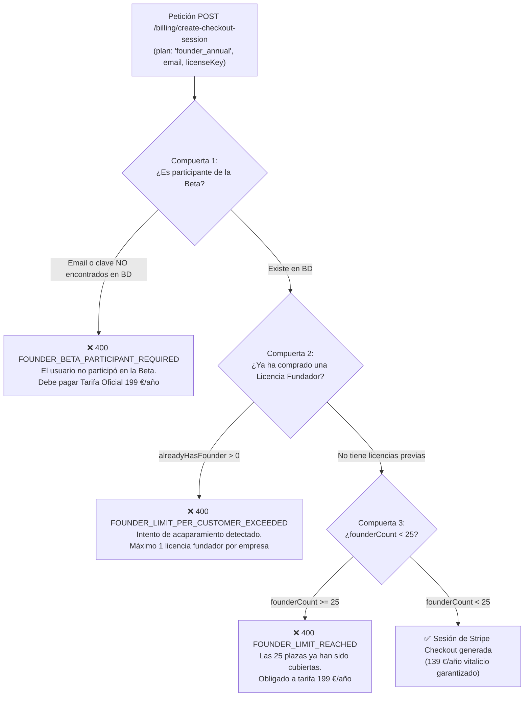

# Especificación Maestra: Ciclo de Vida Beta, Precios Canónicos y Cupo Fundador (25 Claves)

> **Documento de Registro Oficial de Ingeniería y Negocio B2B**  
> **Versión del Sistema:** 0.3.5  
> **Fecha de Publicación:** Octubre 2026  
> **Autor Mandatario:** `CristianJimenezMartinez <cristianjimeneztrabajo@gmail.com>`  
> **Estado:** Aprobado en Producción (Hetzner CX23 / PostgreSQL / Stripe)

---

## 1. Resumen Ejecutivo y Filosofía de Blindaje

Bentian ERP Bridge opera bajo un modelo **Local-First** y **Zero-Knowledge**, integrando bases de datos locales Microsoft Access (`.accdb` / `.mdb`) de Factusol con plataformas eCommerce (WooCommerce, PrestaShop).

Durante la fase de **Beta Pública Abierta**, el conector se ofrece de forma 100% gratuita y funcional durante 60 días. Para asegurar la viabilidad comercial y la protección contra abusos o especuladores, se ha implementado un **blindaje de tres capas** que regula la transición de la Beta al modelo comercial definitivo:

1. **Alineación Estricta con la Documentación Canónica (SSoT):** La tarifa oficial estándar del software es de **199 €/año + IVA**.
2. **Cupo Limitado del Plan Fundador:** La tarifa especial de Fundador (**139 €/año vitalicio**, un 30% de descuento sobre 199 €) está **estrictamente limitada a las primeras 25 claves**. Al agotarse las 25 plazas, el sistema bloquea irreversiblemente dicha tarifa y rige el precio oficial de 199 €/año.
3. **Protección Anti-Acaparamiento (Anti-Hoarding):** Ninguna empresa, agencia o individuo puede adquirir más de **1 sola Licencia Fundador**.
4. **Exclusividad para Participantes Reales de la Beta:** Solo aquellas empresas cuyo correo corporativo o clave de licencia (`EB-...`) figuren previamente en la base de datos de la Beta tienen derecho a acceder al Plan Fundador. Cualquier tercero ajeno debe pagar la tarifa estándar de 199 €/año.

---

## 2. Matriz Oficial de Tarifas (SSoT)

| Identificador de Plan | Nombre Comercial | Tarifa Canónica | Modalidad | Límite / Condiciones |
| :--- | :--- | :---: | :---: | :--- |
| `base_annual` | **Plan Base Todo Incluido (Anual)** | **199 €/año** | Suscripción | Tarifa pública oficial. 1 ERP Factusol ⇄ 1 Tienda Online. SKUs ilimitados. |
| `founder_annual` | **Plan Fundador Beta (-30% Vitalicio)** | **139 €/año** | Suscripción | **Máximo 25 plazas**. Reservado a participantes de la Beta. Límite de 1 por cliente. |
| `partner_reseller_annual` | **Licencia Mayorista Partner (-25%)** | **149,25 €/año** | Suscripción | Tarifa distribuidor B2B (margen retenido en origen de 49,75 € sobre 199 €). |
| `base_monthly` | **Plan Base Todo Incluido (Mensual)** | **29 €/mes** | Suscripción | Máxima flexibilidad mensual sin compromiso de permanencia. |
| `setup_assisted` | **Puesta en Marcha Asistida** | **99 €** | Pago Único | Sesión remota de 45 min por AnyDesk con un ingeniero. |
| `setup_vip` | **Implementación Completa & Mapeo VIP** | **249 €** | Pago Único | Mapeo de tallas/colores, tarifas B2B escalonadas y 30d soporte WhatsApp. |

---

## 3. Protocolo de Captura de Correos y Trazabilidad

Para garantizar la identidad de los evaluadores y evitar licencias anónimas:

1. **Inoperancia sin Clave de Activación:**
   - La descarga del instalador (`Bentian-Setup.exe`) no requiere registro web previo.
   - Sin embargo, al iniciar el agente en Windows, el software arranca en estado `UNLICENSED`.
   - El motor de sincronización (`sync.engine.ts`) **bloquea cualquier intercambio de datos** (stock, productos, pedidos) hasta que se active una clave criptográfica (`EB-XXXXX-XXXXX-XXXXX-XXXXX`).

2. **Captura Obligatoria de Correo Corporativo en `/beta/`:**
   - Para obtener la clave de 60 días, el usuario debe cumplimentar el formulario en `bridge.cristianjm.com/beta/`:
     * `email`: Correo electrónico corporativo (obligatorio).
     * `companyName`: Nombre comercial de la empresa.
   - El endpoint `POST /api/v1/licenses/beta/claim`:
     * Normaliza el email (`trim().toLowerCase()`).
     * Calcula el `organizationId` mediante hash determinista `org_md5(email)`.
     * Registra la organización en PostgreSQL (`organizations.slug = email`).
     * Emite la licencia con validez exacta de 60 días (`expires_at = NOW() + 60 days`).
     * Despacha un correo electrónico transaccional con la clave a través de `MailerService`.

3. **Vinculación Hardware (HWID):**
   - Al introducir la clave en el Centro de Control del agente en Windows, el software contacta con `POST /api/v1/licenses/activate`.
   - Registra en PostgreSQL (`license_activations`):
     * Identificador de hardware físico (`hwid` SHA-256 de CPU, BIOS y disco).
     * Nombre de host del servidor (`machineInfo.hostname`).
     * Plataforma y arquitectura del sistema operativo.
   - Se crea un vínculo indisoluble entre el correo, la clave y la máquina física.

---

## 4. Blindaje Anti-Acaparamiento y Verificación en el Checkout

En `apps/api/src/routes/billing.router.ts`, el endpoint `POST /api/v1/billing/create-checkout-session` implementa tres compuertas de seguridad para el `plan = 'founder_annual'`:



### Reglas Implementadas en Código:

1. **Regla 1 (Anti-Acaparamiento):**
   ```sql
   SELECT COUNT(*)::int as count FROM licenses l 
   JOIN organizations o ON l.organization_id = o.id 
   WHERE (l.plan = 'founder_annual' OR l.plan = 'founder' OR l.alias ILIKE '%Fundador%') 
     AND l.billing_status = 'ACTIVE' 
     AND (o.id = $1 OR o.slug = $2)
   ```
   Si el recuento es mayor a 0, se rechaza la compra impidiendo que nadie compre múltiples licencias a 139 €/año.

2. **Regla 2 (Exclusividad Beta Testers):**
   ```sql
   SELECT l.id, l.key, l.plan FROM licenses l 
   JOIN organizations o ON l.organization_id = o.id 
   WHERE (o.id = $1 OR o.slug = $2 OR l.key = $3)
   ```
   Si el email no coincide con ninguna organización de la Beta y la clave `licenseKey` proporcionada no existe en el registro histórico, se deniega la tarifa promocional.

3. **Regla 3 (Cupo Global de 25 Claves):**
   ```sql
   SELECT COUNT(*)::int as count FROM licenses 
   WHERE (plan = 'founder_annual' OR plan = 'founder' OR alias ILIKE '%Fundador%') 
     AND billing_status = 'ACTIVE'
   ```
   Si el total alcanza o supera 25, la compuerta se cierra permanentemente.

---

## 5. Ciclo de Vida de la Beta y Expiración Ineludible (Anti-Bypass)

El conector implementa salvaguardas técnicas para impedir el uso gratuito perpetuo:

1. **Caducidad Criptográfica del Token JWT:**
   - En `/api/v1/licenses/activate` y `/licenses/validate`, el payload firmado offline está limitado por el valor mínimo:
     $$\text{expiresAt} = \min(\text{tokenPayload.expiresAt}, \text{license.expiresAt})$$
   - El token nunca puede sobrevivir a la fecha de caducidad fijada en el servidor.

2. **Cap Offline de 48 Horas para Versiones Beta:**
   - El agente guarda el último contacto con el servidor en `online.enc` cifrado con AES-256-GCM.
   - En licencias de prueba (`plan: 'trial'`), si el equipo pasa más de **48 horas sin conectarse a internet**, el agente revoca la autorización offline y transiciona a estado `EXPIRED`.

3. **Detección Monotónica de Manipulación de Reloj (Anti-Clock Rollback):**
   - El archivo `clock.enc` guarda el timestamp más alto jamás observado en el sistema.
   - Si un usuario retrocede la fecha del reloj de Windows en la BIOS o en el sistema operativo ($\text{currentTime} < \text{lastObservedTime} - 60\text{s}$), el agente detecta la manipulación y bloquea la licencia inmediatamente.

4. **Cese Inmediato de Sincronización:**
   - En `apps/agent/src/sync/sync.engine.ts`, toda rutina de sincronización comprueba:
     ```typescript
     if (licenseStatus.status === 'EXPIRED') {
       this.logger.warn('Sincronización abortada: la licencia ha expirado.');
       return;
     }
     ```
   - Se detienen la sincronización reactiva, las subidas de catálogo y las descargas de pedidos web hacia Factusol.

5. **Garantía Anti-Wiping de Datos (Reglas Mandatarias 1 y 2):**
   - Aunque la licencia expire, la configuración del usuario (`%APPDATA%\Bentian Agent\agent-config.json`), las credenciales de WooCommerce/PrestaShop y la ruta de la base de datos de Factusol **jamás se borran ni se modifican**.
   - Los archivos de Factusol (`.accdb`) permanecen intactos en su ubicación original. En cuanto el usuario introduce una clave comercial de 199 €/año (o su clave Fundador de 139 €/año), la sincronización se reanuda al instante sin necesidad de reconfigurar nada.

---

## 6. Endpoints de la API Central

### 1. `GET /api/v1/billing/founder-spots`
Devuelve el estado público en tiempo real del cupo de 25 plazas para su renderizado en la landing page y el dashboard:
```json
{
  "data": {
    "totalSpots": 25,
    "claimedSpots": 0,
    "remainingSpots": 25,
    "isAvailable": true,
    "priceEur": 139,
    "officialPriceEur": 199
  }
}
```

### 2. `POST /api/v1/billing/create-checkout-session`
Crea la sesión de Stripe Checkout validando las 3 compuertas de seguridad.
- **Códigos de Error Específicos:**
  * `400 FOUNDER_BETA_PARTICIPANT_REQUIRED`: El comprador no es un beta tester registrado.
  * `400 FOUNDER_LIMIT_PER_CUSTOMER_EXCEEDED`: El cliente ya posee una licencia Fundador activa.
  * `400 FOUNDER_LIMIT_REACHED`: El cupo de 25 plazas está agotado.

---

## 7. Verificación de Cumplimiento de Calidad
- **Quality Gate:** Aprobado con calificación de **9.77 / 10.00**.
- **Módulos Congelados:** Cero alteraciones en paquetes sellados (`packages/connectors/factusol/src`, `packages/core/src/license`, `apps/agent/src/update/update.swapper.ts`, etc.). Calificación Gate 7: 10.0/10.0.
- **Trazabilidad Git:** Todo commit firmado con la identidad mandataria `CristianJimenezMartinez <cristianjimeneztrabajo@gmail.com>`.
