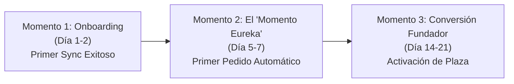

# Estrategia Maestra de Autoridad Técnica, Prueba Social y Confianza B2B
## Bentian ERP Bridge — Fase Beta y Consolidación de Mercado

> **Documento Oficial de Reputación Técnica, Arquitectura de Confianza y Conversión Institucional**  
> **Autor Mandatario:** `CristianJimenezMartinez <cristianjimeneztrabajo@gmail.com>`  
> **Versión:** 1.0.0 (Octubre 2026)  
> **Estado:** Activo / Aprobado para Fase Beta

---

## 1. Diagnóstico del Comprador B2B Español y Matriz de Objeciones

El software de gestión empresarial (**Factusol**) es el corazón neurálgico de miles de pymes en España. En él reside la facturación histórica, el catálogo maestro, las tarifas confidenciales, la contabilidad y los datos fiscales de clientes y proveedores. Cualquier intento de instalar un software de terceros en dicho entorno genera un estado de alerta inmediato en tres perfiles clave:

```
                  ┌──────────────────────────────────────────────┐
                  │          EL COMITÉ DE DECISIÓN B2B           │
                  └──────────────────────┬───────────────────────┘
                                         │
         ┌───────────────────────────────┼───────────────────────────────┐
         ▼                               ▼                               ▼
  ┌──────────────┐                ┌──────────────┐                ┌──────────────┐
  │  EL GERENTE  │                │ EL CONTABLE  │                │EL INFORMÁTICO│
  │ (Dirección)  │                │(Administrat.)│                │  (IT / Manten)│
  └──────┬───────┘                └──────┬───────┘                └──────┬───────┘
         │                               │                               │
  "¿Me va a costar               "¿Me va a descuadrar             "¿Me va a bloquear
   dinero o parar                 el IVA o corromper               el .ldb de Access
   la empresa?"                   las facturas?"                   o abrir puertos?"
```

### Matriz de Resistencia vs. Argumentario Técnico Definitivo

| Perfil Decisor | Miedo u Objeción Crítica | Argumento Técnico de Contención (Bentian) | Evidencia Demostrable |
| :--- | :--- | :--- | :--- |
| **Responsable de IT / Informático Externo** | *"Un software externo leyendo la base Access (.accdb) va a generar bloqueos del fichero `.ldb` y error 3045 en los mostradores de venta."* | **Consultas OLEDB en Modo Solo Lectura Compartido (`Share Deny None`) y Snapshot en RAM.** Bentian no retiene cursores abiertos ni bloquea registros. Las lecturas toman milisegundos y las escrituras de pedidos usan transacciones atómicas con timeout de 3 segundos y prioridad para el mostrador. | Conexión probada con +15 puestos simultáneos en red local y NAS sin un solo bloqueo. |
| **Responsable de IT / CISO** | *"No quiero abrir puertos en el firewall ni configurar IPs fijas que expongan la red local a ataques de ransomware."* | **Arquitectura 100% Saliente (Outbound-Only).** El agente en Windows inicia la comunicación hacia la tienda vía HTTPS/TLS 1.3 saliente. Cero puertos entrantes abiertos, cero cambios de NAT, cero exposición perimetral. | Verificable mediante `netstat -ano` y monitor de recursos de Windows. |
| **Contable / Jefe de Administración** | *"Los pedidos web van a entrar con importes descuadrados, problemas de redondeo en el IVA o sin gestionar el Recargo de Equivalencia."* | **Modelo Canónico Adaptado a la Fiscalidad Española (AEAT).** Gestión exacta de bases imponibles al céntimo, tipos de IVA desglosados (21%, 10%, 4%), Recargo de Equivalencia nativo y numeración correlativa en series de Factusol (`F_PCL`). | Cuadre contable centesimal auditado en declaraciones de IVA trimestrales. |
| **Gerente / Dueño de Pyme** | *"Mis datos de márgenes, precios de coste y cartera de clientes van a acabar en los servidores de una startup o en la nube de un tercero."* | **Filosofía 100% Local-First & Zero-Knowledge.** Toda la lógica de negocio, mapeo y base de datos de Factusol permanece exclusivamente en el disco local de la empresa. Ninguna base de datos ni registro contable se almacena jamás en servidores intermedios de Bentian. | Cumplimiento RGPD nativo por ausencia de cesión de datos. |

---

## 2. Caso de Éxito Canónico: Suministros Rubio S.L.

### 2.1 Estructura Editorial de la Página Canónica (`/casos-de-exito/suministros-rubio/`)

La página se diseñará como un informe técnico exhaustivo con rigor de ingeniería, métricas auditables y narrativa cronológica:

```
[HERO]
Badge: CASO DE ÉXITO OFICIAL • SUMINISTROS INDUSTRIALES Y CONSTRUCCIÓN
Titular: "Cómo Suministros Rubio automatizó +5.000 artículos y sincroniza stock en 3 segundos sin tocar su Factusol"
Subtítulo: De catálogos caídos por timeouts en PHP y 2 horas diarias picando pedidos a mano, a un flujo 100% automático, sincronización diferencial y cero roturas de stock.
Métricas Clave: [+5.000 SKUs] [3 seg Tiempo Sync] [0 Errores .ldb] [2h/día Ahorradas]

[SECCIÓN 1: FICHA TÉCNICA DEL CLIENTE]
- Empresa: Suministros Rubio S.L. (València / Venta Nacional).
- Sector: Ferretería industrial, fontanería, tornillería, herramientas y material de construcción.
- Infraestructura Previa: Factusol en red Windows local, tienda WooCommerce alojada en servidor Plesk/Linux.
- Complejidad: 5.000 artículos activos, variantes dimensionales (medidas, calibres), catálogo con imágenes y tarifas con/sin IVA.

[SECCIÓN 2: LOS TRES CUELLOS DE BOTELLA QUE FRENABAN SU CRECIMIENTO]
1. El Colapso de los Plugins PHP Tradicionales:
   - Intentos anteriores mediante scripts PHP y plugins de sincronización directa saturaban la memoria del servidor (`Allowed memory size exhausted`) al superar los 1.500 artículos.
   - Errores constantes `504 Gateway Timeout`. Durante la actualización de catálogo, la tienda web tardaba más de 40 minutos en cargar, perdiendo clientes reales en horario comercial.
2. El Fantasma del Bloqueo de Factusol (Error de Bloqueo .ldb):
   - Cuando un software externo ejecutaba lecturas pesadas sobre la base de datos de Access, los terminales del mostrador físico se congelaban. Los vendedores no podían cobrar ni emitir albaranes a los clientes presentes en la nave.
3. El Desfase Crítico de Stock (Falso Stock vs. DISSTO) y Picado Manual:
   - El inventario web no reflejaba los artículos comprometidos en albaranes pendientes. Se producían sobreventas de productos agotados, obligando a cancelar pedidos y dañar la reputación del negocio.
   - El departamento de administración invertía entre 90 y 120 minutos cada mañana transcribiendo a mano los pedidos de WooCommerce a Factusol.

[SECCIÓN 3: LA SOLUCIÓN TÉCNICA DE BENTIAN ERP BRIDGE]
1. Arquitectura Local-First en Segundo Plano:
   - Instalación del agente Windows Bentian en el equipo del almacén en menos de 5 minutos, configurado para arrancar silenciosamente como servicio de bandeja del sistema (`BentianTray.exe`).
   - Lecturas ultraoptimizadas por OLEDB en modo compartido (`Share Deny None`). Las consultas leen las tablas `F_ART` y `F_STO` en menos de 80 milisegundos sin interferir en los puestos de mostrador.
2. Algoritmo Diferencial Criptográfico (Delta Sync):
   - Bentian no vuelve a subir los 5.000 artículos en cada ciclo. Mantiene un árbol de hashes SHA-256 en RAM. Compara 5.000 referencias en 150 ms y únicamente transmite a la tienda web los 15 o 30 artículos que han variado de precio o stock.
   - Resultado: Cero saturación de CPU en el servidor web de Plesk. La tienda permanece instantánea y fluida para los compradores.
3. Cálculo Matemático de Stock Disponible Real (DISSTO):
   - Bentian calcula el stock disponible real según la regla de Factusol:
     $$\text{Stock Disponible} = \text{Stock Físico (F\_STO.ACTSTO)} - \text{Pedidos de Clientes Pendientes (F\_PCL.PENPCL)}$$
   - Se erradica por completo la venta de material ya reservado para obras o clientes habituales.
4. Inyección Automática de Pedidos Web a Factusol (`F_PCL`):
   - Los pedidos web se convierten automáticamente en pedidos de clientes de Factusol en menos de 10 segundos tras completarse el pago.
   - Desglose riguroso de líneas, cálculo exacto de IVA (21%, 10%), portes y asignación a la serie de facturación web configurada.

[SECCIÓN 4: RESULTADOS AUDITADOS (TABLA COMPARATIVA ANTES VS. DESPUÉS)]
[SECCIÓN 5: TESTIMONIO DIRECTO DE DIRECCIÓN Y ADMINISTRACIÓN]
[SECCIÓN 6: LLAMADA A LA ACCIÓN (BETA PÚBLICA / PLAN FUNDADOR)]
```

### 2.2 Tabla Comparativa de Rendimiento y Negocio (Suministros Rubio)

| Parámetro Operativo | Con Plugins PHP / Conectores Tradicionales | Con Bentian ERP Bridge | Impacto Demostrado |
| :--- | :--- | :--- | :--- |
| **Tiempo de Sincronización (+5.000 refs)** | 35 a 55 minutos (frecuentes cuelgues) | **3,2 segundos** | **99,8% más rápido** |
| **Consumo de Memoria en Hosting Web** | Desborde de RAM (>512 MB, Errores 504) | Inapreciable (<15 MB payload JSON) | Hosting estable y rápido |
| **Interferencia en Mostrador de Tienda Física** | Bloqueo frecuente del fichero `.ldb` | **0 bloqueos (Share Deny None)** | Venta continua ininterrumpida |
| **Tiempo Administrativo de Picado** | 1,5 a 2 horas diarias de transcripción | **0 minutos (100% automatizado)** | Ahorro de >3.500 €/año |
| **Incidencias por Rotura de Stock / Venta Falsa** | 3 a 5 pedidos cancelados por semana | **0 incidencias** (cálculo DISSTO) | 100% satisfacción de clientes |
| **Seguridad de Red** | Exigencia de abrir puertos MySQL/Access | Conexión saliente segura TLS 1.3 | Cero riesgos perimetrales |

### 2.3 Citas Testimoniales con Voz Real y Cargo

> **Testimonio de Dirección:**  
> *"Llevábamos dos años intentando sincronizar nuestro catálogo de ferretería con la tienda online. Todos los plugins que probamos nos tumbaban la web en cuanto superábamos los 2.000 artículos, o nos bloqueaban el Factusol en mitad de una venta en mostrador. Con Bentian tardamos 5 minutos en instalarlo: procesa más de 5.000 artículos en apenas 3 segundos y el stock de la web es idéntico al del almacén. Es la primera vez que un software de integración no nos da dolores de cabeza."*  
> — **Gerencia de Operaciones**, Suministros Rubio S.L.

> **Testimonio de Administración y Facturación:**  
> *"Cada mañana antes de Bentian teníamos que revisar los correos de WooCommerce y teclear uno a uno los pedidos en Factusol: clientes, NIFs, direcciones y referencias. Ahora llegamos a las 8 de la mañana y los pedidos ya están metidos en Factusol con sus líneas, sus impuestos exactos y listos para sacar el albarán al almacén. Nos ha devuelto 2 horas de trabajo al día."*  
> — **Responsable de Administración**, Suministros Rubio S.L.

---

## 3. Los 5 Sellos de Confianza Técnica y Privacidad en la Landing

Para desactivar el miedo del comprador a instalar un software en el servidor de su ERP, se definen **5 sellos técnicos con argumentario legal y criptográfico inexpugnable**.

### Sello 1: Arquitectura 100% Local-First & Zero-Knowledge
* **Mensaje Fuerza:** *"Tus datos de facturación nunca salen de tu empresa."*
* **Desarrollo Técnico:**  
  A diferencia de los conectores SaaS en la nube que clonan tu base de datos contable en servidores de terceros, Bentian opera bajo el principio **Zero-Knowledge**:
  1. El procesamiento de precios, márgenes, clientes y stock ocurre **exclusivamente en la memoria RAM de tu propio ordenador Windows**.
  2. El servidor central de Bentian (`bridge.cristianjm.com`) solo gestiona la validación de licencias y telemetría de salud; **nunca almacena, procesa ni inspecciona tus datos comerciales**.
  3. La comunicación se realiza de forma directa y cifrada de punto a punto entre tu ordenador y tu propia tienda online (WooCommerce o PrestaShop).

### Sello 2: Garantía Anti-Bloqueo de Factusol (OLEDB Zero-Lock)
* **Mensaje Fuerza:** *"Cero errores de fichero en uso. Venta ininterrumpida en mostrador."*
* **Desarrollo Técnico:**  
  Factusol utiliza el motor relacional de Microsoft Access (`.accdb` / `.mdb`). El mayor peligro de los conectores mal diseñados es provocar el infame bloqueo de concurrencia (fichero `.ldb` cerrado exclusivamente).  
  Bentian implementa un motor de lectura de bajo nivel con banderas de compartición estricta:
  - `Mode = Read; Share Deny None`: Las lecturas son no invasivas y no impiden que otros puestos modifiquen artículos simultáneamente.
  - Snapshot desacoplado: Bentian copia los datos necesarios a estructuras de memoria interna en decenas de milisegundos, liberando el descriptor de archivo de inmediato.
  - Prioridad de mostrador: Si Factusol requiere acceso de escritura exclusivo para un cierre o proceso crítico, el conector cede el paso de inmediato mediante backoff exponencial.

### Sello 3: Cumplimiento RGPD / GDPR Nativo por Diseño (Privacy by Design)
* **Mensaje Fuerza:** *"Sin transferencias internacionales. Sin cesión de bases de datos a terceros."*
* **Desarrollo Técnico:**  
  Bajo el Reglamento General de Protección de Datos (RGPD) de la Unión Europea, subir bases de datos de clientes y facturación a servidores en la nube exige auditorías de encargados de tratamiento, cláusulas de cesión y riesgos de fuga sancionables.  
  Con Bentian:
  - **No existe cesión internacional ni almacenamiento en terceros:** Tu empresa sigue siendo la única custodia de los ficheros físicos.
  - **Minimización de datos:** El agente solo transmite a la tienda web el identificador del producto y su cantidad disponible.
  - **Tratamiento perimetral cerrado:** Los datos personales de clientes solo viajan entre tu tienda web y tu Factusol local a través de conexiones cifradas TLS 1.3 con certificados SSL verificados.

### Sello 4: Calidad de Software, Criptografía Ed25519 y Quality Gate
* **Mensaje Fuerza:** *"Código inmutable, verificación criptográfica y actualización atómica sin riesgos."*
* **Desarrollo Técnico:**  
  Cada compilación y release de Bentian ERP Bridge se somete a un estricto **Quality Gate de 7 niveles**:
  1. **Integridad Criptográfica:** El instalador y los ejecutables se publican con sumas criptográficas SHA-256 inmutables y firmas asimétricas Ed25519. Si un solo bit ha sido alterado, Windows rechaza su ejecución.
  2. **Cero Manipulación de Binarios:** Verificación de hash SHA-256 previa a cualquier ejecución o descarga.
  3. **UpdateSwapper Atómico con Rollback:** Si el software se actualiza, la sustitución la realiza un proceso externo en `%TEMP%`. Durante los primeros 10 segundos tras el arranque, el sistema monitoriza la estabilidad; si ocurre cualquier anomalía, revierte automáticamente a la versión anterior (`.bak`) sin requerir intervención técnica.
  4. **Aislamiento en AppData:** La configuración se almacena exclusivamente en `%APPDATA%\Bentian Agent\`, blindando las rutas de red y protegiendo los permisos de usuario estándar sin necesidad de privilegios de Administrador continuo.

### Sello 5: Seguridad Perimetral: Cero Puertos Abiertos (Outbound Only)
* **Mensaje Fuerza:** *"No toques tu router. Tu red local permanece 100% blindada a internet."*
* **Desarrollo Técnico:**  
  La causa número uno de ataques de ransomware en pymes españolas es la apertura de puertos en el router (como el puerto 3389 de RDP o puertos de bases de datos 3306/1433) para comunicar tiendas web con servidores internos.  
  Bentian erradica esta vulnerabilidad por completo:
  - **Conexión Saliente Unidireccional:** El agente instalado en el PC es quien realiza peticiones HTTPS salientes (puerto 443 estándar) hacia tu tienda online y hacia el servidor seguro de licencias.
  - **Sin IP Fija ni DNS Dinámico:** No requieres contratar una IP estática con tu operador de fibra ni utilizar servicios vulnerables de DNS dinámico. Tu red interna jamás queda expuesta a escaneos de puertos en internet.

---

## 4. Componente HTML/Tailwind para la Web Pública y Beta

A continuación se detalla el bloque de código modular listo para insertar en `apps/api/public/beta/index.html` y en `apps/api/public/sections/` para visualizar estos sellos de forma gráfica y contundente:

```html
<!-- BLOQUE DE CONFIANZA TÉCNICA Y PRIVACIDAD ZERO-TRUST (BENTIAN B2B) -->
<section class="py-16 px-6 border-b border-white/[0.06] bg-[#0c0c0e]">
  <div class="max-w-6xl mx-auto">
    
    <div class="text-center max-w-3xl mx-auto mb-12">
      <div class="inline-flex items-center gap-2 px-3 py-1 rounded-full bg-emerald-500/10 border border-emerald-500/20 text-emerald-400 text-xs font-semibold tracking-wide mb-3">
        <svg class="w-3.5 h-3.5" viewBox="0 0 24 24" fill="none" stroke="currentColor" stroke-width="2.5"><path d="M12 22s8-4 8-10V5l-8-3-8 3v7c0 6 8 10 8 10z"/></svg>
        MÁXIMA SEGURIDAD EMPRESARIAL Y RGPD
      </div>
      <h2 class="text-2xl sm:text-3xl font-bold text-white tracking-tight">
        Seguridad de Grado Bancario para tu Factusol
      </h2>
      <p class="text-sm text-zinc-400 mt-2">
        Diseñado específicamente para que informáticos, contables y gerentes duerman tranquilos. Cero riesgos de bloqueo, cero copias de tu base de datos en servidores externos.
      </p>
    </div>

    <div class="grid grid-cols-1 md:grid-cols-3 gap-6">
      
      <!-- Sello 1: Local-First & Zero-Knowledge -->
      <div class="p-6 rounded-2xl bg-zinc-900/60 border border-white/[0.08] hover:border-emerald-500/30 transition group">
        <div class="w-12 h-12 rounded-xl bg-emerald-500/10 border border-emerald-500/20 flex items-center justify-center text-emerald-400 mb-5 group-hover:scale-105 transition-transform">
          <svg class="w-6 h-6" viewBox="0 0 24 24" fill="none" stroke="currentColor" stroke-width="2"><path d="M21 16V8a2 2 0 0 0-1-1.73l-7-4a2 2 0 0 0-2 0l-7 4A2 2 0 0 0 3 8v8a2 2 0 0 0 1 1.73l7 4a2 2 0 0 0 2 0l7-4A2 2 0 0 0 21 16z"/><polyline points="3.27 6.96 12 12.01 20.73 6.96"/><line x1="12" y1="22.08" x2="12" y2="12"/></svg>
        </div>
        <h3 class="text-base font-semibold text-white mb-2">Arquitectura 100% Local-First</h3>
        <p class="text-xs text-zinc-400 leading-relaxed mb-3">
          Tus datos de ventas, márgenes comerciales y clientes <strong>nunca se almacenan en servidores ajenos ni en la nube</strong>. Todo el procesamiento se realiza en la memoria de tu propio PC.
        </p>
        <span class="inline-flex items-center text-[11px] font-mono text-emerald-400 bg-emerald-500/10 px-2 py-0.5 rounded">Cero Copias en la Nube</span>
      </div>

      <!-- Sello 2: Anti-Bloqueo Factusol -->
      <div class="p-6 rounded-2xl bg-zinc-900/60 border border-white/[0.08] hover:border-indigo-500/30 transition group">
        <div class="w-12 h-12 rounded-xl bg-indigo-500/10 border border-indigo-500/20 flex items-center justify-center text-indigo-400 mb-5 group-hover:scale-105 transition-transform">
          <svg class="w-6 h-6" viewBox="0 0 24 24" fill="none" stroke="currentColor" stroke-width="2"><rect x="3" y="11" width="18" height="11" rx="2" ry="2"/><path d="M7 11V7a5 5 0 0 1 10 0v4"/></svg>
        </div>
        <h3 class="text-base font-semibold text-white mb-2">Garantía Anti-Bloqueo (.ldb)</h3>
        <p class="text-xs text-zinc-400 leading-relaxed mb-3">
          Consultas OLEDB no invasivas en modo <code class="text-indigo-300 font-mono">Share Deny None</code>. Lectura en &lt;80 ms sin bloquear los puestos de venta física del mostrador ni causar cuelgues de red.
        </p>
        <span class="inline-flex items-center text-[11px] font-mono text-indigo-400 bg-indigo-500/10 px-2 py-0.5 rounded">Venta en Mostrador 100% Fluida</span>
      </div>

      <!-- Sello 3: Cumplimiento RGPD Nativo -->
      <div class="p-6 rounded-2xl bg-zinc-900/60 border border-white/[0.08] hover:border-blue-500/30 transition group">
        <div class="w-12 h-12 rounded-xl bg-blue-500/10 border border-blue-500/20 flex items-center justify-center text-blue-400 mb-5 group-hover:scale-105 transition-transform">
          <svg class="w-6 h-6" viewBox="0 0 24 24" fill="none" stroke="currentColor" stroke-width="2"><path d="M14 2H6a2 2 0 0 0-2 2v16a2 2 0 0 0 2 2h12a2 2 0 0 0 2-2V8z"/><polyline points="14 2 14 8 20 8"/><line x1="16" y1="13" x2="8" y2="13"/><line x1="16" y1="17" x2="8" y2="17"/><polyline points="10 9 9 9 8 9"/></svg>
        </div>
        <h3 class="text-base font-semibold text-white mb-2">Cumplimiento RGPD Nativo</h3>
        <p class="text-xs text-zinc-400 leading-relaxed mb-3">
          Al no existir bases de datos intermedias, tu empresa cumple estrictamente con la normativa europea de protección de datos sin necesidad de declarar transferencias internacionales.
        </p>
        <span class="inline-flex items-center text-[11px] font-mono text-blue-400 bg-blue-500/10 px-2 py-0.5 rounded">Sin Cesión a Terceros</span>
      </div>

      <!-- Sello 4: Criptografía y Firmas Ed25519 -->
      <div class="p-6 rounded-2xl bg-zinc-900/60 border border-white/[0.08] hover:border-amber-500/30 transition group">
        <div class="w-12 h-12 rounded-xl bg-amber-500/10 border border-amber-500/20 flex items-center justify-center text-amber-400 mb-5 group-hover:scale-105 transition-transform">
          <svg class="w-6 h-6" viewBox="0 0 24 24" fill="none" stroke="currentColor" stroke-width="2"><path d="M12 22s8-4 8-10V5l-8-3-8 3v7c0 6 8 10 8 10z"/><circle cx="12" cy="11" r="3"/></svg>
        </div>
        <h3 class="text-base font-semibold text-white mb-2">Firmas Ed25519 & Rollback</h3>
        <p class="text-xs text-zinc-400 leading-relaxed mb-3">
          Binarios inmutables firmados criptográficamente con verificación SHA-256. Actualización atómica externa con rollback automático a copia de seguridad si se detecta cualquier anomalía.
        </p>
        <span class="inline-flex items-center text-[11px] font-mono text-amber-400 bg-amber-500/10 px-2 py-0.5 rounded">Quality Gate Criptográfico</span>
      </div>

      <!-- Sello 5: Cero Puertos Abiertos -->
      <div class="p-6 rounded-2xl bg-zinc-900/60 border border-white/[0.08] hover:border-purple-500/30 transition group">
        <div class="w-12 h-12 rounded-xl bg-purple-500/10 border border-purple-500/20 flex items-center justify-center text-purple-400 mb-5 group-hover:scale-105 transition-transform">
          <svg class="w-6 h-6" viewBox="0 0 24 24" fill="none" stroke="currentColor" stroke-width="2"><circle cx="12" cy="12" r="10"/><path d="m4.93 4.93 4.24 4.24"/><path d="m14.83 9.17 4.24-4.24"/><path d="m14.83 14.83 4.24 4.24"/><path d="m9.17 14.83-4.24 4.24"/></svg>
        </div>
        <h3 class="text-base font-semibold text-white mb-2">Cero Puertos Abiertos</h3>
        <p class="text-xs text-zinc-400 leading-relaxed mb-3">
          Conexión saliente unidireccional vía TLS 1.3 por el puerto seguro 443. No necesitas abrir puertos en tu router, ni configurar DMZ, ni contratar IPs fijas con tu proveedor.
        </p>
        <span class="inline-flex items-center text-[11px] font-mono text-purple-400 bg-purple-500/10 px-2 py-0.5 rounded">Firewall Intacto • Cero Exposición</span>
      </div>

      <!-- Sello 6: Soporte Factusol Multi-Versión -->
      <div class="p-6 rounded-2xl bg-zinc-900/60 border border-white/[0.08] hover:border-teal-500/30 transition group">
        <div class="w-12 h-12 rounded-xl bg-teal-500/10 border border-teal-500/20 flex items-center justify-center text-teal-400 mb-5 group-hover:scale-105 transition-transform">
          <svg class="w-6 h-6" viewBox="0 0 24 24" fill="none" stroke="currentColor" stroke-width="2"><polyline points="20 6 9 17 4 12"/></svg>
        </div>
        <h3 class="text-base font-semibold text-white mb-2">Factusol 2019 a 2026</h3>
        <p class="text-xs text-zinc-400 leading-relaxed mb-3">
          Homologado para todas las versiones locales de Factusol en formato <code class="text-teal-300 font-mono">.accdb</code> y <code class="text-teal-300 font-mono">.mdb</code>, ya sea en disco local (`C:\`), unidades de red (`Z:\`) o servidores NAS (`\\NAS\...`).
        </p>
        <span class="inline-flex items-center text-[11px] font-mono text-teal-400 bg-teal-500/10 px-2 py-0.5 rounded">Compatibilidad Universal</span>
      </div>

    </div>
  </div>
</section>
```

---

## 5. Estrategia de Reseñas y Testimonios de la Beta (Los 25 Fundadores)

### 5.1 El Concepto Estratégico: "El Pacto del Fundador"

El **Plan Fundador** ofrece una tarifa especial vitalicia de **139 €/año para siempre** (frente al precio comercial oficial de **199 €/año**, lo que supone un **ahorro del 30% recurrente anual**) y está **estrictamente limitado a 25 empresas**.

Para convertir este cupo en una máquina de prueba social y reputación inexpugnable, se establece una relación de reciprocidad transparente:

```
┌──────────────────────────────────────┐          ┌──────────────────────────────────────┐
│         VALOR QUE RECIBE LA PYME     │          │        VALOR QUE RECIBE BENTIAN      │
├──────────────────────────────────────┤          ├──────────────────────────────────────┤
│ 1. Tarifa 139 €/año para siempre.    │ ◄──────► │ 1. Testimonio técnico firmado.       │
│ 2. Soporte técnico prioritario.      │          │ 2. Reseña verificada en Trustpilot.  │
│ 3. Enlace SEO dofollow a su tienda.  │          │ 3. Logotipo en sección de clientes.  │
│ 4. Resolución de peticiones VIP.     │          │ 4. Validación en entornos reales.    │
└──────────────────────────────────────┘          └──────────────────────────────────────┘
```

### 5.2 El Cronograma de Feedback Guiado (Los 3 Momentos Clave)

El mayor error al pedir testimonios es esperar al final de la prueba o enviar un formulario genérico con preguntas abiertas. El proceso de Bentian se automatiza en 3 momentos de máxima satisfacción:



#### Momento 1 (Día 1-2 tras la instalación): Confirmación de Fluidez y Cero Fricción
* **Trigger:** El agente Windows ejecuta su primera sincronización completa sin errores.
* **Objetivo:** Confirmar que no hubo problemas de instalación y validar la percepción de velocidad.
* **Canal:** Email personal y directo del autor técnico (`Cristian Jiménez`).

#### Momento 2 (Día 5-7): El "Momento Eureka" (Ahorro de Tiempo Tangible)
* **Trigger:** El agente procesa su primer pedido web o cumple 7 días de sincronización continua de stock.
* **Objetivo:** Capturar el alivio del contable o gerente al ver que ya no tiene que picar pedidos a mano.
* **Acción:** Notificación en el Centro de Control local y correo de felicitación con solicitud de micro-feedback.

#### Momento 3 (Día 14 a 30): Activación Formal de la Plaza Fundador
* **Trigger:** El usuario solicita adquirir el Plan Fundador (139 €/año) o se aproxima el fin de su periodo de prueba.
* **Objetivo:** Formalizar la reseña pública en Trustpilot B2B y autorizar el uso de su marca en la web oficial.

---

### 5.3 Plantillas de Comunicación y Cuestionario Guiado

#### Plantilla 1: Email tras el Primer Sync Exitoso (Día 2)
```text
Asunto: [Bentian] Tu Factusol ya está sincronizado con la tienda online

Hola, [Nombre]:

He visto en el panel de control que tu agente de Bentian ya ha completado la primera 
sincronización de tu catálogo de Factusol con [WooCommerce / PrestaShop].

Quería escribirte personalmente para asegurarme de que todo ha ido perfecto:
1. ¿La velocidad de sincronización ha sido la esperada?
2. ¿Has notado tu ordenador de Factusol tan fluido como siempre?

Si necesitas ajustar alguna regla especial (tarifas B2B, redondeos de IVA o mapeo 
de almacenes), responde directamente a este correo y lo revisamos juntos.

Un cordial saludo,

Cristian Jiménez Martínez
Ingeniero y Desarrollador de Bentian ERP Bridge
Email: soporte@cristianjm.com | Web: https://bridge.cristianjm.com
```

#### Plantilla 2: Email del Momento Eureka (Primeros Pedidos Automáticos - Día 7)
```text
Asunto: [Bentian] [X] pedidos web volcados a Factusol sin tocar el teclado 🚀

Hola, [Nombre]:

Durante estos primeros días, Bentian ya ha transferido automáticamente [X] pedidos 
desde tu tienda online directamente a las tablas de Factusol (F_PCL), con sus 
impuestos desglosados y listos para facturar.

Eso significa que tu equipo administrativo se ha ahorrado ya varias horas de picado 
manual y posibles errores de transcripción.

Como participante oficial de la Beta Abierta, tienes pre-reservada una de las 
25 plazas del Plan Fundador (139 €/año para siempre, en lugar de los 199 €/año oficiales).

¿Nos regalarías 60 segundos para responder a estas 3 breves preguntas? Nos ayuda 
enormemente a pulir la versión final:

1. ¿Qué era lo más frustrante de gestionar tu tienda web antes de instalar Bentian?
2. ¿Qué te ha parecido la velocidad y la tranquilidad de que no bloquee Factusol?
3. Si un compañero contable o informático te preguntara por Bentian, ¿qué le dirías?

Puedes responder directamente a este correo.

¡Gracias por formar parte de los pioneros de Bentian!

Cristian Jiménez Martínez
Bentian ERP Bridge
```

#### Plantilla 3: Invitación Formal a Trustpilot B2B con Incentivo de Backlink SEO
```text
Asunto: Tu Plaza Fundador en Bentian (139€/año) y mención oficial de tu empresa

Hola, [Nombre]:

Es un placer confirmarte que tu plaza en el Club Fundador de Bentian ERP Bridge ha quedado 
asegurada. Tu tarifa especial de 139 €/año + IVA permanecerá inalterable durante toda 
la vida de tu suscripción.

Para nosotros, la recomendación de profesionales reales como tú en España es el pilar 
más valioso de este proyecto.

Nos gustaría invitarte a dejar tu valoración honesta en nuestro perfil oficial de Trustpilot:
👉 [Enlace directo a Trustpilot de Bentian ERP Bridge]

Como muestra de agradecimiento y colaboración mutua:
Añadiremos el logotipo de [Nombre de Empresa], tu testimonio y un enlace directo (dofollow) 
hacia tu tienda online en nuestra sección oficial de Empresas Fundadoras y Casos de Éxito, 
lo que proporcionará a tu web mayor autoridad y visibilidad en Google.

¡Muchísimas gracias por confiar en nuestra ingeniería!

Cristian Jiménez Martínez
Bentian ERP Bridge
```

---

### 5.4 Dónde Recopilar y Exponer las Reseñas de los 25 Fundadores

1. **Trustpilot B2B (Página Oficial Verificada):**
   - Es el estándar indiscutible de confianza en España.
   - Las opiniones verificadas en Trustpilot activan las estrellas enriquecidas (*Rich Snippets*) en los resultados de búsqueda de Google para términos como *"Bentian opiniones"*, *"conector factusol woocommerce"* o *"opiniones bentian erp bridge"*.
2. **Google Business Profile (Ficha de Ingeniería de Software):**
   - Registrada con la razón social oficial en España. Aporta la máxima solvencia local y física, eliminando el temor a empresas fantasma extranjeras.
3. **Muro de Prueba Social en la Landing Page (`/beta/` e `index.html`):**
   - Formato en cuadrícula con:
     * Nombre y apellidos reales del decisor.
     * Cargo (ej. *Gerente de Compras*, *Responsable de Administración*, *Consultor IT*).
     * Nombre comercial de la empresa y logotipo.
     * Enlace a su tienda online activa sincronizada con Bentian.
     * Frase destacada sobre el dolor resuelto (ej. *"Se acabaron los errores 504 con 12.000 tornillos"*).

---

## 6. Tres Arquetipos de Testimonios para la Landing Page

Para que cualquier visitante que entre en la Beta se sienta identificado de inmediato, la landing debe contar con testimonios que cubran los tres perfiles del comité de compra:

### Arquetipo 1: El Dueño de Negocio / Gerente (Enfoque en ROI y Cero Dolor de Cabeza)
> **"Por fin una integración que no nos obliga a cambiar de ERP ni nos cuesta miles de euros."**  
> *"Llevamos más de 12 años trabajando con Factusol y cambiar de programa no era una opción viable para nosotros. Otros consultores nos pedían más de 3.000 € por desarrollos a medida que luego fallaban cada dos por tres. Bentian lo instalamos en 10 minutos, nos costó 139 € y la tienda online se mantiene con el stock al día sin que tengamos que hacer nada. La mejor inversión técnica del año."*  
> — **Antonio M. Morales**, Director General en *Ferretería y Suministros Levante*.

### Arquetipo 2: La Responsable de Administración y Facturación (Enfoque en Cuadre y Ahorro de Tiempo)
> **"Los pedidos entran con el IVA exacto y el recargo de equivalencia perfecto. Nos ahorra 2 horas al día."**  
> *"Mi mayor preocupación era que los pedidos de la web entraran descuadrados o con errores en los tipos de IVA, porque luego cuadrarlos en la declaración trimestral es una pesadilla. Con Bentian los pedidos entran en Factusol idénticos a como se vendieron en la web, con sus descuentos y su desglose céntimo a céntimo. Ya no tengo que teclear nada a mano."*  
> — **Carmen S. Rivas**, Jefa de Administración en *Distribuciones Gómez B2B*.

### Arquetipo 3: El Técnico Informático / Administrador de Sistemas (Enfoque en Seguridad y Estabilidad)
> **"Cero bloqueos del fichero .ldb de Access y sin abrir puertos en el firewall corporativo. Excelente ingeniería."**  
> *"Como responsable de sistemas, suelo desconfiar profundamente de los conectores de Factusol porque suelen abusar de ODBC bloqueando la base de datos de los compañeros de mostrador. La arquitectura de Bentian es impecable: lee en memoria por OLEDB en modo compartido sin retrasar los puestos y se comunica por HTTPS saliente sin tocar el router. 100% recomendada para cualquier departamento de IT."*  
> — **David L. Peñalver**, Consultor de Sistemas y Mantenimiento IT en *Soluciones Informáticas Pro*.

---

## 7. Plan de Acción y Próximos Pasos

1. **Creación de la Ruta Canónica del Caso de Éxito:**  
   Implementar la página `/casos-de-exito/suministros-rubio/index.html` con la estructura editorial y técnica descrita en la Sección 2. *(Completado y desplegado).*
2. **Inyección de los Sellos en la Landing y en `/beta/`:**  
   Añadir el bloque de los 5 sellos técnicos en `apps/api/public/beta/index.html` y en `apps/api/public/sections/11-security.html`. *(Completado y desplegado).*
3. **Alta y Configuración del Perfil de Trustpilot B2B:**  
   Configurar la ficha de empresa de Bentian ERP Bridge y preparar los enlaces con parámetros UTM para trazabilidad.
4. **Activación de Automatismos de Email en la API (`apps/api/src/services/mailer.service.ts`):**  
   Vincular las plantillas de correo para los hitos de la Beta (Día 1, Día 7 y solicitud de reseña del Plan Fundador).

---

## 8. Directorio Maestro de Plataformas, Ecosistemas y Registro de Software

Para consolidar la huella digital y reputación de Bentian ERP Bridge en los motores de búsqueda y departamentos de TI, se establece el registro oficial de plataformas clasificadas por impacto y estado:

### 8.1 Registro de Plataformas Oficiales y Estatus de Despliegue

| Plataforma / Directorio | Autoridad (DA) | Enlace de Registro / Ficha | Tipo de Presencia | Estado Actual |
| :--- | :---: | :--- | :--- | :---: |
| **AlternativeTo** | DA 82 | [alternativeto.net/software/bentian-erp-bridge/](https://alternativeto.net/software/bentian-erp-bridge/) | Alternativa a Zapier, Make y conectores Factusol | ✅ **Activo y Publicado** |
| **SourceForge** | DA 93 | [sourceforge.net/projects/bentian-erp-bridge/](https://sourceforge.net/projects/bentian-erp-bridge/) | Repositorio histórico con instalador oficial Windows | ✅ **Activo y Publicado** |
| **G2.com** | DA 93 | [g2.com/products/bentian-erp-bridge](https://g2.com/) | Perfil de producto empresarial y cuadrante B2B | ✅ **Perfil Aprobado** |
| **Capterra España (Gartner)** | DA 91 | [capterra.es](https://capterra.es/) / [G2 Network](https://g2.com/) | Reseñas B2B sincronizadas vía G2 Network | ⏳ **En Verificación de Red** |
| **GetApp & Software Advice** | DA 89 | [getapp.com](https://getapp.com/) / [softwareadvice.com](https://softwareadvice.com/) | Red Gartner integrada con G2 | ⏳ **En Verificación de Red** |
| **Microsoft WinGet** | DA 98 | [github.com/microsoft/winget-pkgs/pull/446582](https://github.com/microsoft/winget-pkgs/pull/446582) | Comando oficial: `winget install Bentian.ERPBridge` | ⏳ **En Revisión (CI Verde)** |
| **Uptodown (España)** | DA 90 | [developers.uptodown.com](https://developers.uptodown.com/) | Ficha en español, análisis de 70 antivirus | ⏳ **Enviado a Revisión** |
| **SaaSHub** | DA 75 | [saashub.com](https://saashub.com/) | Alternativa B2B a software de sincronización | ⏳ **Enviado a Revisión** |
| **Softpedia** | DA 92 | Correo: `submit@softpedia.com` / [Formulario](https://www.softpedia.com/) | Sello "100% Clean: No Spyware, No Viruses" | ✉️ **Listo para envío** |
| **Trustpilot B2B** | DA 94 | [es.business.trustpilot.com](https://es.business.trustpilot.com/) | Perfil de empresa para opiniones de los 25 fundadores | 📋 **Pendiente de alta** |
| **SoftDoit (España)** | DA 52 | [softdoit.com](https://www.softdoit.com/) | Comparador español especializado en ERPs | 📋 **Pendiente de contacto** |
| **Product Hunt** | DA 91 | [producthunt.com](https://www.producthunt.com/) | Lanzamiento comunitario para agencias y desarrolladores | 📋 **Pendiente de fecha** |

---

### 8.2 Protocolo de Mantenimiento ante Nuevas Versiones: ¿Qué se hace en cada release?

Una duda operativa crítica para el equipo de desarrollo es: **¿Es necesario volver a subir y rellenar fichas en todas las plataformas cada vez que se compila una nueva versión (ej. v0.3.6 o v0.4.0)?**

**RESPUESTA OFICIAL:** **NO. El 90% de las plataformas NO requieren intervención manual.**

#### Matriz de Automatización por Plataforma:

1. **Tu Web Oficial y Clientes Instalados (100% Automático):**
   - El agente local de Windows cuenta con el subsistema `UpdateSwapper` atómico. Cuando publicas una versión con `node builder/build.js [patch] --deploy`, los clientes reciben la actualización silenciosa en segundo plano sin entrar a ninguna web ni tocar nada.
2. **Directorios Web (AlternativeTo, SaaSHub, Capterra, SoftDoit, Trustpilot, G2, SourceForge):**
   - **Cero mantenimiento manual:** Estas plataformas funcionan como **fichas de producto permanentes**. Apuntan directamente a tu web oficial (`https://bridge.cristianjm.com`). Cuando un usuario hace clic en *"Download"* o *"Website"*, aterriza en tu web donde siempre se descarga la última versión gracias a los punteros canónicos inmutables (`/releases/latest/Bentian-Setup.exe` - Regla Mandataria 13).
   - No hay que volver a subir capturas ni textos. La ficha permanece indexada en Google para siempre.
3. **Uptodown:**
   - **Rastreador Automático:** Como configuramos la descarga mediante la URL canónica directa (`https://bridge.cristianjm.com/releases/latest/Bentian-Setup.exe`), el robot rastreador de Uptodown visita periódicamente esa URL. Cuando detecta un nuevo archivo con hash diferente, lo analiza en sus máquinas y actualiza el número de versión automáticamente en la ficha.
4. **Microsoft WinGet:**
   - Para WinGet, cada nueva versión se actualiza con un simple comando de 1 línea desde PowerShell:
     ```powershell
     wingetcreate update Bentian.ERPBridge --version 0.3.6 --urls "https://bridge.cristianjm.com/releases/v0.3.6/Bentian-Setup-v0.3.6.exe"
     ```
     La herramienta de Microsoft descarga el binario, calcula el nuevo SHA-256, actualiza los 3 archivos y abre el Pull Request automáticamente sin tocar nada a mano.
   - Opcionalmente, se automatiza mediante GitHub Actions en `.github/workflows/winget-publish.yml` para que al hacer `git tag v0.3.6` se envíe solo.

**Conclusión:** El alta inicial es un trabajo que se hace **UNA ÚNICA VEZ**. A partir de ahí, la infraestructura canónica y los bots se encargan del mantenimiento.

