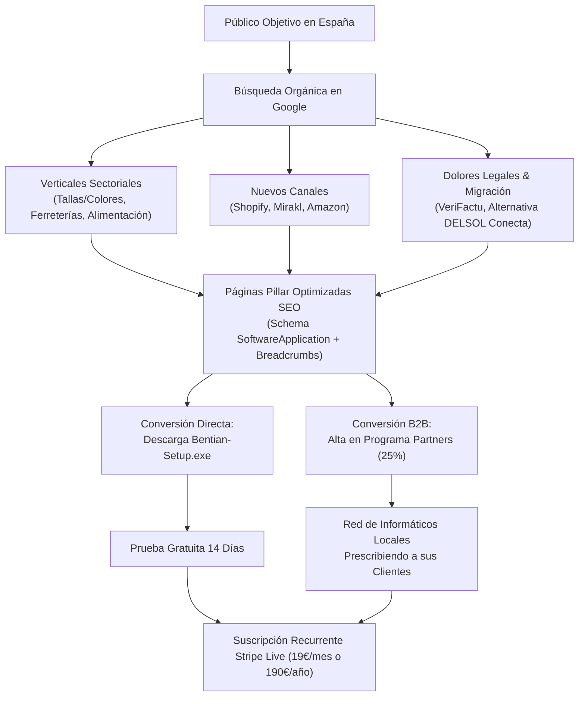

# Estrategia Maestra de Dominio Orgánico y Captación de Mercado B2B: Bentian ERP Bridge

> **Elaborado por:** Estratega Jefe de Dominio Orgánico y Captación B2B  
> **Fecha:** Octubre 2026  
> **Ámbito:** España — Monopolización de búsquedas transaccionales e informáticas en torno a Factusol, Software DELSOL, eCommerce y Marketplaces.  
> **Estado:** Documento Operativo de Expansión.

---

## 1. MAPA DE DEMANDA Y BÚSQUEDAS NO EXPLOTADAS (EL OCÉANO AZUL DE BENTIAN)

### 1.1. Perfiles de Decisión de Compra en España
El ecosistema de Factusol en España cuenta con más de **130.000 pymes activas**, concentradas en empresas de distribución mayorista, minoristas tradicionales, suministros y fabricantes medianos. Identificamos 3 perfiles que realizan búsquedas continuas en Google:

1. **El Informático / Mantenimiento TI Externo (Partner de Oro)**:
   - **Quién es:** Administrador de sistemas local o consultor informático freelance que lleva el mantenimiento de 10 a 40 pymes en polígonos industriales de su comarca o provincia.
   - **Su dolor crítico:** El cliente le exige poner una tienda online o vender en Amazon/Mirakl. El informático no es programador web a fondo y le aterra que un script PHP colapse el servidor o corrompa la base de datos de Factusol (`.FDB` / `.mdb`).
   - **Qué busca:** *"conector factusol woocommerce estable"*, *"api local factusol sin nube"*, *"conectar factusol con prestashop sin tocar codigo"*.
   - **Gancho Bentian:** 100% Local-First, sin puertos abiertos ni redirecciones raras, instalador `.exe` transparente, y **25% de comisión recurrente de por vida** vía Programa de Partners.

2. **El Director de Operaciones / Dueño de la PYME**:
   - **Quién es:** Dueño de una ferretería, distribuidora de bebidas o tienda de suministros.
   - **Su dolor crítico:** "Doble picado de albaranes" (empleados dedicando 3 horas al día a copiar pedidos de la web a Factusol a mano) y roturas de stock (vender un producto en mostrador y que alguien lo compre por la web 10 minutos después).
   - **Qué busca:** *"sincronizar pedidos web factusol automatico"*, *"actualizar stock factusol woocommerce a tiempo real"*, *"precio conector factusol prestashop"*.
   - **Gancho Bentian:** Sincronización instantánea (<80ms), cero errores de stock y 14 días de prueba gratuita sin tarjeta.

3. **La Agencia de Diseño Web / eCommerce**:
   - **Quién es:** Especialistas en WordPress, WooCommerce o Shopify que desarrollan la tienda online del cliente pero se topan con el "muro" del ERP de escritorio Windows.
   - **Su dolor crítico:** Los plugins PHP comerciales de la competencia (Festeweb, ShopCloud, etc.) saturan el hosting compartido (errores 504 Gateway Timeout por ejecución pesada de `wp-cron`).
   - **Qué busca:** *"webhook factusol woocommerce"*, *"integrar shopify factusol delsol"*, *"conector factusol api rest"*.

---

### 1.2. Análisis de Sectores Verticales de Factusol y sus Dolores Específicos

| Sector Vertical | Particularidad Técnica en Factusol | Gran Dolor con los Conectores Actuales | Oportunidad SEO de Captación |
| :--- | :--- | :--- | :--- |
| **Moda, Calzado y Textil** | Matriz de Tallas y Colores (`F_ART` + `F_TLL` + `F_COL`). | Los plugins crean productos simples sueltos o duplican variaciones, rompiendo los selectores visuales en la web y el stock por talla. | Landing vertical: *"Conector Factusol Tallas y Colores para WooCommerce y PrestaShop"*. |
| **Ferreterías y Suministros Industriales** | Catálogos masivos (20.000 a 100.000 referencias), tarifas múltiples (1 a 5) y descuentos por volumen. | Los plugins PHP agotan la memoria del servidor (`Allowed memory size exhausted`) al consultar catálogos pesados. | Landing vertical: *"Sincronización de Catálogos Masivos y Tarifas B2B Factusol"*. |
| **Distribución de Alimentación y Bebidas** | Trazabilidad por Lotes y Caducidades (`F_LTT`), envases retornables y Recargo de Equivalencia (R.E.). | WooCommerce y PrestaShop no calculan por defecto el Recargo de Equivalencia en pedidos B2B y no sincronizan fechas de consumo preferente. | Landing vertical: *"Factusol y Recargo de Equivalencia en eCommerce: Guía y Conector Fiscal"*. |
| **Recambios de Automoción y Maquinaria** | Referencias cruzadas (OEM), pesos volumétricos y rotación crítica de existencias. | Retardo de 30-60 minutos en sincronizar stock; provoca ventas de piezas sin existencias. | Landing vertical: *"Sincronización en Tiempo Real Factusol para Recambistas"*. |

---

### 1.3. Oportunidad en Marketplaces y Multicanal

Las pymes en España ya no se conforman con tener una sola tienda online. El verdadero crecimiento comercial reside en los **Marketplaces**:

1. **El Fenómeno Mirakl en España**:
   - Plataformas líderes como **Leroy Merlin, Carrefour, Decathlon, PcComponentes y Brico Depôt** operan sobre la tecnología de Mirakl.
   - Las empresas quieren publicar su catálogo de Factusol en estos marketplaces y descargar los pedidos consolidados directamente en Factusol para que su almacén prepare el envío.
   - **Vacío del mercado:** No existe ningún conector de escritorio accesible que permita volcar Factusol hacia Mirakl sin pagar desarrollos a medida de 4.000€ a 10.000€.
2. **Amazon Seller (SP-API)**:
   - Sincronización obligatoria en <15 minutos de pedidos FBM (envío por el vendedor), actualización de números de seguimiento y obligación estricta de subir facturas PDF en 24h a Amazon para evitar la suspensión de la cuenta de vendedor.
3. **Shopify**:
   - Crecimiento acelerado en España de marcas B2C que huyen de WordPress pero conservan Factusol para la administración de stock, compras y facturación fiscal.

---

### 1.4. Competencia, Frustraciones y Búsquedas de Sustitución ("Conquesting")

* **Los Dolores de la Competencia (Festeweb, O2W, Conecta Software, ShopCloud)**:
  1. **Precios abusivos / Cuotas ocultas:** Cuotas mensuales de 60€ a 180€/mes más costes de alta de 300€ a 800€.
  2. **Obligatoriedad de DELSOL Cloud:** Muchos conectores exigen contratar el Alojamiento Cloud de DELSOL o una suscripción de soporte oficial anual para poder usar su API web. Esto encarece el coste total a más de 1.000€/año.
  3. **Plugins PHP lentos que tumban tiendas:** Sincronizaciones ejecutadas por scripts PHP en el servidor web que provocan cuelgues durante picos de visitas o promociones.
* **El Enfoque Ganador de Bentian**:
  - Funciona con **Factusol Local de escritorio** (sin necesidad de pagar la nube de DELSOL).
  - Motor compilado en C#/Node.js que se ejecuta en la máquina Windows local donde reside la base de datos OLEDB/Access, sincronizando de forma ultrarrápida (<80ms) por Webhooks y APIs seguras.
  - Precio transparente y accesible (19€/mes o 190€/año).

---

### 1.5. El Impulso Regulatorio en España (Apalancamiento de Urgencia 2025/2026)

1. **Ley Crea y Crece (Facturación Electrónica B2B)**:
   - Obligatoriedad progresiva de emitir y recibir factura electrónica estructurada entre empresas y profesionales.
   - Las tiendas online que venden a empresas deben asegurar que el pedido web se facture legalmente en el ERP.
2. **Reglamento VeriFactu (Real Decreto 1007/2023)**:
   - Los sistemas informáticos de facturación deben asegurar inalterabilidad, trazabilidad y encadenamiento criptográfico.
   - Si una tienda online emite "facturas" por su cuenta sin coordinarse con Factusol, se arriesga a sanciones tributarias graves. **Factusol debe ser el emisor fiscal centralizado**.
3. **TicketBAI y Batuz (País Vasco)**:
   - Facturación con código QR y fichero XML firmado en tiempo real con las Haciendas Forales.

---

## 2. ESTRATEGIA DE CONTENIDOS Y PÁGINAS 'PILLAR' (TOP 8 DE MÁXIMO ROI)

A continuación se definen los 8 pilares de contenido orgánico diseñados para captar el 100% de la demanda B2B con alta intención de compra.

---

### PILAR 1: Tallas y Colores (Moda, Calzado, Textil y Deporte)
* **Título SEO**: *Conector Factusol Tallas y Colores — Sincronización Automática con WooCommerce y PrestaShop*
* **URL Canónica**: `https://bridge.cristianjm.com/factusol-tallas-colores/`
* **Intención de Búsqueda**: Transaccional e investigativa ("cómo conectar factusol tallas y colores", "conector calzado factusol woocommerce").
* **Palabras Clave Primarias**: `factusol tallas y colores woocommerce`, `sincronizar tallas y colores factusol prestashop`, `conector moda factusol`, `variaciones factusol woocommerce`.
* **Propuesta de Valor & Conversión a Descarga**:
  - Explica exactamente cómo Bentian lee las tablas `F_ART`, `F_TLL` y `F_COL` de Factusol y las transforma en variaciones limpias con atributos nativos en WooCommerce y combinaciones en PrestaShop.
  - Soluciona el error clásico de productos duplicados o rotura de SKUs.
  - **CTA**: *"Descarga Bentian ERP Bridge y sincroniza tu catálogo de moda en 5 minutos con prueba gratuita de 14 días"*.

---

### PILAR 2: Conector Factusol Shopify (El Nicho de Mayor Poder Adquisitivo)
* **Título SEO**: *Conector Factusol Shopify — Sincronización en Tiempo Real de Pedidos, Stock y Catálogo*
* **URL Canónica**: `https://bridge.cristianjm.com/factusol-shopify/`
* **Intención de Búsqueda**: Transaccional directa ("conectar factusol shopify", "integrar shopify factusol delsol").
* **Palabras Clave Primarias**: `conector factusol shopify`, `sincronizar factusol con shopify`, `factusol shopify integration`, `pedidos shopify en factusol`.
* **Propuesta de Valor & Conversión a Descarga**:
  - Posicionamiento único: Shopify no tiene conector nativo de escritorio para Factusol.
  - Explica la integración bidireccional: creación de pedidos de Shopify como albaranes/pedidos en Factusol, deducción instantánea de stock y actualización de precios.
  - **CTA**: Enlace directo a `Bentian-Setup.exe` y botón de activación de prueba sin tarjeta.

---

### PILAR 3: Ferreterías y Suministros Industriales (Catálogos Masivos & Tarifas B2B)
* **Título SEO**: *Conector Factusol para Ferreterías y Suministros Industriales — Catálogos Masivos y Tarifas Escaladas*
* **URL Canónica**: `https://bridge.cristianjm.com/factusol-ferreterias-suministros/`
* **Intención de Búsqueda**: Solución técnica B2B ("sincronizar catálogo grande factusol woocommerce", "conector ferreteria factusol").
* **Palabras Clave Primarias**: `conector factusol suministros industriales`, `factusol ferreteria woocommerce`, `sincronizar 50000 productos factusol`, `tarifas b2b factusol prestashop`.
* **Propuesta de Valor & Conversión a Descarga**:
  - Demuestra con benchmarks por qué Bentian puede sincronizar más de 50.000 artículos en segundos sin agotar la memoria PHP de WordPress gracias a su algoritmo diferencial por hash SHA-256 de fila.
  - Soporte nativo para Tarifas 1, 2, 3, 4 y 5 de Factusol asignadas a roles B2B en la tienda web.
  - **CTA**: Descarga del software con selector de tarifas preconfigurado.

---

### PILAR 4: Sincronización con Marketplaces (Leroy Merlin, PcComponentes, Mirakl, Amazon)
* **Título SEO**: *Sincronizar Factusol con Marketplaces — Leroy Merlin, PcComponentes (Mirakl) y Amazon SP-API*
* **URL Canónica**: `https://bridge.cristianjm.com/factusol-marketplaces/`
* **Intención de Búsqueda**: Expansión multicanal y comercial ("conectar factusol leroy merlin", "sincronizar factusol mirakl", "pedidos amazon en factusol").
* **Palabras Clave Primarias**: `conector factusol marketplaces`, `factusol leroy merlin mirakl`, `sincronizar factusol amazon seller`, `factusol pccomponentes api`.
* **Propuesta de Valor & Conversión a Descarga**:
  - Responde a la gran necesidad de las pymes de centralizar el stock de Amazon, Leroy Merlin y PcComponentes en su almacén físico gestionado por Factusol.
  - Evita las penalizaciones por falta de stock (*stockout*) en los marketplaces.
  - **CTA**: Solicitud de demo guiada y descarga de la versión para canales externos.

---

### PILAR 5: Recargo de Equivalencia y Facturación Fiscal B2B
* **Título SEO**: *Factusol y Recargo de Equivalencia en WooCommerce y PrestaShop — Guía Definitiva de Integración Fiscal*
* **URL Canónica**: `https://bridge.cristianjm.com/factusol-recargo-equivalencia/`
* **Intención de Búsqueda**: Resolución de problemas fiscales y contables ("recargo de equivalencia factusol woocommerce", "como aplicar recargo equivalencia pedidos web factusol").
* **Palabras Clave Primarias**: `recargo equivalencia factusol woocommerce`, `iva y recargo equivalencia prestashop factusol`, `factusol pedidos web impuestos`, `factura b2b factusol tienda online`.
* **Propuesta de Valor & Conversión a Descarga**:
  - Aborda el vacío legal/técnico: WooCommerce no desglosa bien el 5.2%, 1.4% y 0.5% de recargo.
  - Bentian detecta en la ficha del cliente de Factusol el flag de Recargo de Equivalencia y recalcula las bases imponibles e impuestos en el documento de venta automáticamente.
  - **CTA**: *"Evita descuadres con Hacienda en tus ventas online: instala Bentian en 3 pasos"*.

---

### PILAR 6: Lotes, Caducidades y Trazabilidad Sanitaria
* **Título SEO**: *Trazabilidad en Factusol y eCommerce — Control de Lotes, Caducidad y Stock en Tiempo Real*
* **URL Canónica**: `https://bridge.cristianjm.com/factusol-lotes-trazabilidad/`
* **Intención de Búsqueda**: Sectorial / Cumplimiento normativo ("trazabilidad factusol tienda online", "lotes y caducidades factusol woocommerce").
* **Palabras Clave Primarias**: `factusol lotes woocommerce`, `sincronizar caducidad factusol prestashop`, `trazabilidad alimentaria factusol ecommerce`, `factusol control existencias lotes`.
* **Propuesta de Valor & Conversión a Descarga**:
  - Especialmente enfocado a distribución de alimentación, bodegas, cosmética y productos químicos.
  - Explica la integración con `F_LTT` para mantener el inventario real sin vender partidas caducadas o agotadas.
  - **CTA**: Prueba gratuita y caso de uso para empresas de alimentación.

---

### PILAR 7: Normativa VeriFactu y Ley Crea y Crece con Tiendas Online
* **Título SEO**: *VeriFactu y Facturación Electrónica con Factusol y eCommerce — Cumplimiento Legal 2025/2026*
* **URL Canónica**: `https://bridge.cristianjm.com/verifactu-factusol-ecommerce/`
* **Intención de Búsqueda**: Legal y cumplimiento obligatorio ("verifactu factusol woocommerce", "ley crea y crece factusol tienda online", "ticketbai factusol sincronizacion").
* **Palabras Clave Primarias**: `verifactu factusol woocommerce`, `factura electronica factusol tienda online`, `ley crea y crece factusol prestashop`, `ticketbai factusol pedidos web`.
* **Propuesta de Valor & Conversión a Descarga**:
  - Guía de autoridad legal que explica por qué emitir facturas en WordPress o PrestaShop de forma aislada puede acarrear multas de hasta 50.000€ según la Ley Antifraude si no cumplen VeriFactu.
  - Presenta la arquitectura correcta: WooCommerce recopila el pedido y Factusol genera la factura oficial con código QR y encadenamiento criptográfico.
  - **CTA**: Descarga de Bentian como conector homologado para cumplimiento normativo.

---

### PILAR 8: Comparativa Directa y Migración (Alternativa a DELSOL Conecta y Plugins Tradicionales)
* **Título SEO**: *Factusol Local Sin Cuotas Cloud — Por Qué Bentian Supera a DELSOL Conecta y Plugins Lentos*
* **URL Canónica**: `https://bridge.cristianjm.com/alternativa-delsol-conecta-plugins/`
* **Intención de Búsqueda**: Comparativa de software y búsqueda de sustitución ("alternativa delsol conecta", "factusol woocommerce sin pagar soporte anual", "o2w vs bentian").
* **Palabras Clave Primarias**: `alternativa delsol conecta`, `factusol woocommerce barato`, `conector factusol sin cuotas cloud`, `mejor conector factusol prestashop`.
* **Propuesta de Valor & Conversión a Descarga**:
  - Comparativa directa y honesta en tabla: Precio (19€/mes vs 80€/mes + altas), Latencia (<80ms vs 15-30 minutos), Dependencia (Funciona en local vs Obliga a pagar DELSOL Cloud).
  - Incluye calculadora interactiva de ahorro anual (ahorro de más de 800€/año).
  - **CTA**: Descarga inmediata con migración en 1 clic.

---

## 3. SÍNTESIS EJECUTIVA Y HOJA DE RUTA DE IMPLEMENTACIÓN

### 3.1. Matriz de Prioridad de Esfuerzo vs. Retorno de Inversión (ROI)

| Prioridad | Pilar de Contenido | Impacto en Facturación | Esfuerzo de Implementación | Justificación Comercial |
| :---: | :--- | :---: | :---: | :--- |
| **P1** | **Pilar 1: Tallas y Colores** | 🟢 **Muy Alto** | 🟡 Medio | Es el sector con mayor volumen de tiendas online (moda, calzado) y mayores quejas técnicas con Factusol. |
| **P1** | **Pilar 2: Conector Factusol Shopify** | 🟢 **Muy Alto** | 🟡 Medio | Ticket medio más alto, cero competencia de escritorio nativa en España, usuarios con gran disposición de pago. |
| **P2** | **Pilar 8: Comparativa y Alternativa DELSOL Conecta** | 🟢 **Alto** | 🟢 Rápido | Tráfico de alta conversión en fase final de decisión de compra; capta clientes descontentos de la competencia. |
| **P2** | **Pilar 7: VeriFactu y Facturación Electrónica** | 🟢 **Alto** | 🟢 Rápido | Aprovecha la alarma fiscal de 2025/2026; posiciona a Bentian como garante de legalidad. |
| **P3** | **Pilar 3: Ferreterías y Suministros** | 🟡 Medio-Alto | 🟡 Medio | Consolida el liderazgo en catálogos gigantes y B2B industrial (el core de Suministros Rubio). |
| **P3** | **Pilar 5: Recargo de Equivalencia** | 🟡 Medio | 🟢 Rápido | Nicho técnico puro que ningún competidor explica con claridad; captura 100% del tráfico especializado. |
| **P4** | **Pilar 4: Marketplaces (Mirakl y Amazon)** | 🟢 Alto | 🔴 Alto (Desarrollo) | Abre la puerta a la venta multicanal masiva una vez consolidados los conectores web. |
| **P4** | **Pilar 6: Lotes y Trazabilidad** | 🟡 Medio | 🟡 Medio | Especialización para canal de alimentación y bebidas. |

---

### 3.2. Claves de Arquitectura Web y Calidad (Cumplimiento de Reglas del Proyecto)
1. **Regla de Punteros Inmutables (`/releases/latest/`):**
   - Todas las nuevas páginas deben enlazar a `/releases/latest/Bentian-Setup.exe` y usar data-attributes semánticos (`[data-app-version]`, `[data-download-installer]`).
2. **Schema.org Rich Snippets Obligatorios:**
   - Cada página pilar incluirá `SoftwareApplication`, `BreadcrumbList` y `FAQPage` en formato JSON-LD para conseguir fragmentos destacados y preguntas frecuentes en los resultados de Google.
3. **Optimización de Conversión (CRO):**
   - Botón flotante siempre visible: *"Descargar Instalador Oficial (Prueba 14 días sin compromiso)"*.
   - Sección dedicada al informático local: *"¿Eres consultor o agencia? Gana el 25% recurrente recomendando Bentian"*.
