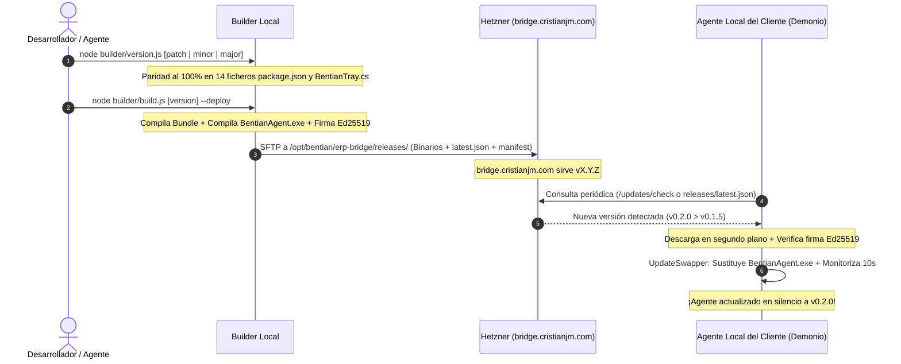

# BENTIAN ERP BRIDGE — NORMAS OFICIALES DE RELEASE Y AUTO-ACTUALIZACIÓN AUTÓNOMA

> **Vigencia:** A partir de la versión `v0.2.0`  
> **Ámbito:** Todo el repositorio `erp-bridge`, ejecutables Windows, API Core y clientes finales.  
> **Objetivo:** Garantizar que cualquier actualización se publique de forma 100% reproducible y que los agentes instalados en las máquinas de los clientes (y en local) se actualicen de manera **autónoma, silenciosa y sin inyección manual**.

---

## 1. PRINCIPIO FUNDAMENTAL: CERO INYECCIÓN MANUAL

> [!CAUTION]
> **PROHIBICIÓN ESTRICTA:**
> Queda terminantemente prohibido copiar o sobrescribir ficheros `.exe` a mano dentro del directorio de instalación local (`%LOCALAPPDATA%\Programs\Bentian Agent\`).
> Si un agente local o de cliente no se actualiza, la causa SIEMPRE reside en el pipeline de publicación (falta de build, falta de firma, falta de deploy o flag inactivo), y NUNCA se debe parpadear o enmascarar copiando archivos manualmente. La máquina debe actualizarse a través de su propio servicio de auto-actualización.

---

## 2. EL CICLO DE VIDA DE UNA RELEASE (PIPELINE DE 4 PASOS)

Cada vez que se complete un ciclo de desarrollo o corrección de bugs, el flujo obligatorio a seguir es el siguiente:



---

## 3. COMANDOS OFICIALES DE 1 CLIC

Para evitar errores humanos o pasos olvidados, se definen los siguientes comandos estándar en la raíz del monorepo:

### A. Subida de versión menor (Nuevas funcionalidades) + Despliegue inmediato
```bash
pnpm run deploy:minor
```
*(Equivalente a: `node builder/build.js minor --deploy`)*.  
Este único comando:
1. Incrementa la versión `MINOR` (ej: `0.2.0` $\rightarrow$ `0.3.0`) en los 14 paquetes.
2. Compila el bundle del agente (`apps/agent/dist`).
3. Compila el ejecutable nativo de Windows (`BentianAgent.exe`).
4. Firma criptográficamente el binario con la clave privada Ed25519 (`builder/keys/update-private.pem`).
5. Genera `manifest.json`, `checksums.txt` y `latest.json`.
6. Transfiere todos los binarios vía SFTP seguro a Hetzner (`178.105.87.40`).
7. Actualiza los punteros `/releases/latest/` y la landing pública.

### B. Subida de parche (Bugfixes rápidos) + Despliegue inmediato
```bash
pnpm run deploy:patch
```
*(Equivalente a: `node builder/build.js patch --deploy`)*.

### C. Solo compilar localmente (sin transferir al servidor)
```bash
node builder/build.js patch
# o
node builder/build.js minor
```

### D. Auditar paridad de versión en todo el monorepo
```bash
node builder/version.js check
```

---

## 4. ESPECIFICACIÓN DEL MOTOR DE ACTUALIZACIÓN DEL AGENTE

El agente local (`LocalAgent` en `apps/agent/src/agent.ts`) debe mantener SIEMPRE la siguiente configuración en su instanciación de `UpdateOptions`:

```typescript
const updateOptions: UpdateOptions = {
  apiBaseUrl: cfg.apiBaseUrl || 'https://bridge.cristianjm.com',
  agentId: cfg.agentId || 'agent_local_standalone',
  currentVersion: this.configManager.getVersion(),
  checkIntervalMs: 60 * 60 * 1000, // Comprobación cada 1 hora
  autoDownload: true,              // Descarga automática en segundo plano
  autoApply: true,                 // Sustitución automática sin requerir clics
  publicKeyPem: '-----BEGIN PUBLIC KEY-----\nMCowBQYDK2VwAyEA2Sc3emV3VqjbPmw5RXc1aaeaz0dtpzwI7WP6eHhDpBU=\n-----END PUBLIC KEY-----',
};
```

### Mecanismo de Doble Canal de Detección (Anti-Fallo)
1. **Canal Primario (API Dinámica):** `POST https://bridge.cristianjm.com/api/v1/updates/check`
2. **Canal Secundario de Resiliencia (CDN Estático):** Si la base de datos o el contenedor de la API estuvieran temporalmente inaccesibles, el agente consulta `GET https://bridge.cristianjm.com/releases/latest.json`.  
   Al ser un archivo estático servido directamente por el servidor web Caddy, la disponibilidad para actualizaciones es del **99.99%**.

---

## 5. SEGURIDAD Y ROLLBACK EN WINDOWS

1. **Firma Criptográfica Ed25519:** Ningún ejecutable se aplica si su hash SHA-256 no coincide exactamente o si la firma digital no está validada por la clave pública oficial de Bentian.
2. **Reemplazo Atómico con PowerShell:** `UpdateSwapper` genera un script temporal en PowerShell que:
   - Cierra ordenadamente los procesos `BentianAgent` y `BentianTray`.
   - Renombra `BentianAgent.exe` a `BentianAgent.exe.bak`.
   - Mueve el nuevo binario a `BentianAgent.exe`.
   - Lanza el nuevo binario y **monitoriza el arranque durante 10 segundos**.
   - **Rollback de emergencia:** Si el nuevo binario crasheara al arrancar, el script revierte automáticamente al archivo `.bak` y relanza la versión anterior, enviando una alerta de fallo.

---

## 6. REGLA MNEMOTÉCNICA PARA FUTURAS SESIONES DE IA

> Si el usuario solicita: *"publica una actualización"*, *"sube versión"* o *"los clientes deben actualizarse"*:
> 1. NO editar manualmente ejecutables en directorios de usuario.
> 2. Ejecutar directamente `pnpm run deploy:minor` o `pnpm run deploy:patch`.
> 3. Verificar que `https://bridge.cristianjm.com/releases/latest.json` devuelva 200 OK con la versión nueva.
> 4. El agente local del usuario y de los clientes se actualizará solo en el siguiente ciclo o al arrancarlo.
