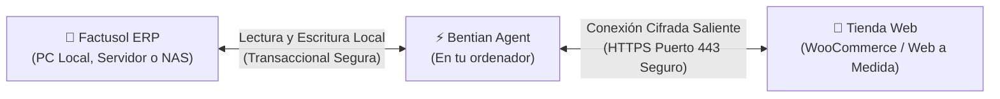
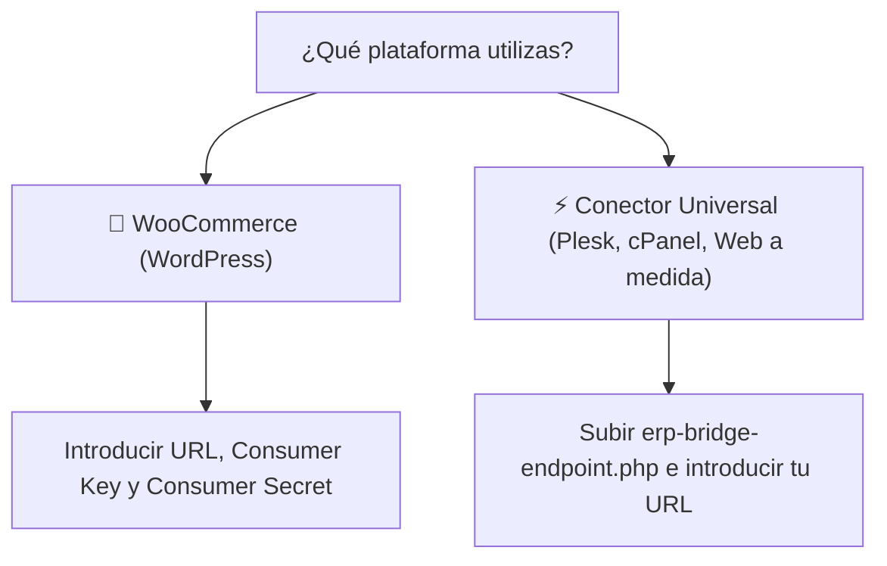

# Guía de Instalación Rápida: Bentian ERP Bridge
## Conecta Factusol con tu Tienda Online en Menos de 5 Minutos

> **Documento Oficial de Puesta en Marcha para Clientes y Empresas**  
> **Destinatarios:** Pymes, comercios, responsables de tienda online y técnicos informáticos.  
> **Objetivo:** Instalación y configuración guiada paso a paso sin requerir conocimientos técnicos avanzados.  
> **Tiempo estimado de configuración:** 5 minutos.  
> **Plataforma:** Bentian ERP Bridge ([https://bridge.cristianjm.com](https://bridge.cristianjm.com))

---

## 1. ¿Cómo Funciona Bentian ERP Bridge?

Bentian ERP Bridge es un programa ligero que se instala en el ordenador o servidor donde tienes Factusol. Su misión es vigilar los cambios de tu inventario y enviar los pedidos de la tienda online a Factusol de forma totalmente automática y segura.



> [!NOTE]
> **Seguridad Total:** Bentian no necesita que abras ningún puerto en tu router ni que expongas tu red a internet. Funciona igual que cuando navegas por la web de tu banco: mediante una conexión saliente cifrada y 100% segura.

---

## 2. Requisitos Mínimos del Sistema

Antes de empezar, comprueba que cumples estos sencillos requisitos:

| Componente | Requisito Recomendado |
| :--- | :--- |
| **Sistema Operativo** | Windows 10, Windows 11 o Windows Server (2016, 2019, 2022) — 64 bits. |
| **Factusol** | Instalado en el mismo PC o accesible en red local / NAS (`C:\...`, `Z:\...`, `\\SERVIDOR\...`). Compatible con versiones 2019 hasta 2026. |
| **Conexión a Internet** | Conexión estándar de fibra o 4G/5G. (No requiere IP fija ni configuración de router). |
| **Tienda Web** | WooCommerce (WordPress) o cualquier tienda web con el conector Universal Bridge instalado. |
| **Clave de Licencia** | Tu código de activación (`EB-XXXXX-...`) recibido por correo electrónico tras suscribirte. |

---

## 3. Paso 1: Descarga del Instalador Oficial

1. Entra en tu correo electrónico y busca el email de bienvenida de Bentian con el asunto **"Tu Licencia y Descarga de Bentian ERP Bridge"**.
2. Haz clic en el enlace de descarga o descárgalo directamente desde el portal oficial:
   👉 **[Descargar BentianSetup.exe](https://bridge.cristianjm.com/download/BentianSetup.exe)**
3. El archivo `BentianSetup.exe` se guardará en tu carpeta habitual de descargas.

---

## 4. Paso 2: Instalación en Windows y Aviso de SmartScreen

1. Haz doble clic sobre el archivo descargado **`BentianSetup.exe`**.
2. **Si Windows muestra la pantalla azul de protección ("Windows protegió su PC"):**  
   Esto es completamente normal en Windows cuando se instala software profesional empresarial recién actualizado. Microsoft SmartScreen verifica la reputación de cada versión nueva.

```
┌──────────────────────────────────────────────────────────────────┐
│  Windows protegió su PC                                      [X] │
├──────────────────────────────────────────────────────────────────┤
│                                                                  │
│  Microsoft Defender SmartScreen evitó el inicio de una           │
│  aplicación no reconocida. Si ejecuta esta aplicación,           │
│  su PC podría estar en riesgo.                                   │
│                                                                  │
│  Más información  <─── [1. HAZ CLIC AQUÍ]                        │
│                                                                  │
│                                           ┌──────────────────┐   │
│                                           │   No ejecutar    │   │
│                                           └──────────────────┘   │
└──────────────────────────────────────────────────────────────────┘

                                 ▼  (La ventana mostrará el botón)

┌──────────────────────────────────────────────────────────────────┐
│  Windows protegió su PC                                      [X] │
├──────────────────────────────────────────────────────────────────┤
│                                                                  │
│  Aplicación: BentianSetup.exe                                    │
│  Editor:     Bentian ERP Bridge / Cristian Jiménez Martínez      │
│                                                                  │
│  ┌─────────────────────────┐             ┌──────────────────┐   │
│  │ Ejecutar de todas formas│             │   No ejecutar    │   │
│  └─────────────────────────┘             └──────────────────┘   │
│               ▲                                                  │
│        [2. PULSA AQUÍ]                                           │
└──────────────────────────────────────────────────────────────────┘
```

> [!TIP]
> **Pasos exactos:**
> 1. Pulsa en el texto subrayado **"Más información"**.
> 2. Haz clic en el botón **"Ejecutar de todas formas"**.
> 
> *Alternativa:* Si prefieres, haz clic derecho sobre `BentianSetup.exe` ➔ selecciona **Propiedades** ➔ marca la casilla **"Desbloquear"** al pie de la ventana ➔ pulsa **Aceptar** y vuelve a abrir el instalador.

3. Sigue los sencillos pasos del asistente de instalación (siguiente, siguiente, instalar). El proceso tarda menos de 30 segundos.
4. Al terminar, el programa se abrirá automáticamente y verás su icono de un puente azul en la barra de tareas de Windows (junto al reloj).

---

## 5. Paso 3: Introducir la Clave de Licencia

Nada más abrir el programa, aparecerá el **Asistente de Configuración Rápida**:

```
┌──────────────────────────────────────────────────────────────────┐
│ 🧙 Asistente de Configuración Rápida                         [X] │
├──────────────────────────────────────────────────────────────────┤
│  [1. Licencia] ──► (2. Factusol) ──► (3. Canal Web) ──► (4. Listo)│
├──────────────────────────────────────────────────────────────────┤
│  Paso 1: Activa tu Licencia                                      │
│  Introduce la clave recibida por email al darte de alta.         │
│                                                                  │
│  Clave de Licencia:                                              │
│  ┌───────────────────────────────────────────────┐ ┌───────────┐ │
│  │ EB-PRO-48291-K92B8-99210-44910                │ │📋 Pegar y │ │
│  └───────────────────────────────────────────────┘ │  Activar  │ │
│                                                    └───────────┘ │
│  ✓ Licencia Activa: Plan Business (Puesto Vinculado)             │
│                                                                  │
│                                           ┌──────────────────┐   │
│                                           │ Siguiente Paso → │   │
│                                           └──────────────────┘   │
└──────────────────────────────────────────────────────────────────┘
```

1. Copia tu clave del correo electrónico (tiene un formato como `EB-STARTER-XXXXX` o `EB-PRO-XXXXX`).
2. Haz clic en el botón **"📋 Pegar y Activar"**.
3. El sistema verificará tu clave en 1 segundo y mostrará una marca de confirmación verde.
4. Pulsa **"Siguiente Paso →"**.

---

## 6. Paso 4: Seleccionar la Base de Datos de Factusol

Ahora le indicamos a Bentian dónde se encuentran los datos de tu empresa en Factusol:

```
┌──────────────────────────────────────────────────────────────────┐
│  Paso 2: Conecta tu Factusol                                     │
│  Selecciona la base de datos de tu empresa en este equipo o red. │
│                                                                  │
│  ┌───────────────────────────┐  ┌─────────────────────────────┐  │
│  │ 🔍 Auto-detectar Factusol │  │ 📁 Examinar en Windows (NAS)│  │
│  └───────────────────────────┘  └─────────────────────────────┘  │
│                                                                  │
│  Ruta seleccionada:                                              │
│  C:\Software DELSOL\Factusol\Datos\FS\0012026.accdb              │
│                                                                  │
│  ✓ Conexión establecida: Empresa detectada (2.450 artículos)     │
└──────────────────────────────────────────────────────────────────┘
```

### ¿Cómo encontrar tu base de datos?

- **Opción A (La más rápida):** Pulsa el botón **"🔍 Auto-detectar Factusol"**. Bentian escaneará las carpetas habituales del disco local y te mostrará el listado de empresas encontradas para que elijas la tuya en 1 clic.
- **Opción B (Para redes y servidores NAS):** Pulsa el botón **"📁 Examinar en Windows (Local / Red / NAS)"**. Se abrirá la ventana oficial de selección de archivos de Windows en primer plano:
  - Si tienes Factusol en este PC: suele estar en `C:\Software DELSOL\Factusol\Datos\FS\` o `C:\Factusol\Datos\FS\`.
  - Si tienes Factusol en red: navega hasta tu unidad compartida (por ejemplo `Z:\Datos\FS\`) o escribe la ruta de red directa (ejemplo: `\\SERVIDOR\Factusol\Datos\FS\`).
  - Selecciona el archivo de datos correspondiente al código de tu empresa y año (por ejemplo `0012026.accdb` o `0012026.mdb`).
- Pulsa **"Probar Conexión"**. En cuanto aparezca el aviso verde de confirmación, pulsa **"Siguiente Paso →"**.

---

## 7. Paso 5: Conectar la Tienda Web

Elige la plataforma que utilizas para vender por internet:



### Opción A: Si utilizas WooCommerce (WordPress)

1. En el selector, haz clic sobre la tarjeta de **WooCommerce**.
2. Escribe la dirección de tu tienda (ejemplo: `https://www.mitienda.com`).
3. Introduce tu **Consumer Key** (`ck_...`) y **Consumer Secret** (`cs_...`).
   > **¿Cómo sacar estas claves en WordPress en 1 minuto?**
   > - Entra en tu panel de administración de WordPress.
   > - Ve al menú **WooCommerce** ➔ **Ajustes** ➔ pestaña **Avanzado** ➔ **REST API**.
   > - Pulsa en **"Añadir clave"**.
   > - En descripción escribe `Bentian ERP`, en permisos selecciona **Lectura/Escritura** y pulsa **"Generar clave de API"**.
   > - Copia las dos cadenas generadas y pégalas en Bentian.
4. Pulsa **"Comprobar Conexión"**.

### Opción B: Si utilizas Conector Web Universal (Plesk, cPanel, Angular, PHP o a medida)

1. En el selector, selecciona **Conector Web Universal**.
2. Pulsa el botón **"⬇️ Descargar erp-bridge-endpoint.php"**. Se descargará un archivo conector listo y preconfigurado con una clave de seguridad privada.
3. Sube ese archivo a la carpeta principal de tu página web (habitualmente llamada `httpdocs`, `public_html` o `www`) usando el Administrador de Archivos de tu hosting (Plesk/cPanel) o tu cliente FTP (FileZilla).
4. Escribe la dirección de tu tienda (ejemplo: `https://www.mitienda.com`) y pulsa **"Comprobar Conexión"**.
5. Bentian ejecutará un checklist visual de 4 pasos (Servidor OK, Certificado SSL OK, Conector OK, Base de datos web OK).

Una vez validada la conexión, pulsa **"Siguiente Paso →"**.

---

## 8. Paso 6: Verificación y Puesta en Marcha

Llegas al último paso del asistente. Pulsa el botón principal:  
👉 **"🚀 Comenzar a Trabajar"**.

El asistente se cerrará y accederás a la **Pantalla Principal (Vista Zen)** de Bentian ERP Bridge:

```
┌──────────────────────────────────────────────────────────────────┐
│  🟢 Sincronización Activa — Todo al día                          │
│  Tu tienda web y Factusol están sincronizados en tiempo real     │
│                                                                  │
│  ┌───────────────────┐  ┌───────────────────┐  ┌───────────────┐ │
│  │ 📦 FACTUSOL ERP   │  │ 🌐 CANAL WEB      │  │ 🔑 LICENCIA   │ │
│  │ Conectado         │  │ Conectado         │  │ Activa        │ │
│  │ 2.450 artículos   │  │ Puerto 443 HTTPS  │  │ Plan Business │ │
│  └───────────────────┘  └───────────────────┘  └───────────────┘ │
│                                                                  │
│                 ┌─────────────────────────────────┐              │
│                 │ 🔄 Forzar Sincronización Manual │              │
│                 └─────────────────────────────────┘              │
└──────────────────────────────────────────────────────────────────┘
```

### ¿Cómo hacer una prueba de funcionamiento en 30 segundos?

1. **Prueba de Stock:**
   - Abre Factusol y modifica las existencias de cualquier artículo de prueba (por ejemplo, cambia el stock de 10 a 15 unidades).
   - Guarda el cambio en Factusol.
   - En la pantalla de Bentian verás cómo el agente detecta el cambio en cuestión de segundos y actualiza el producto en tu tienda online.
   - Abre tu tienda web en el navegador y comprueba que el nuevo stock ya está disponible para tus clientes.
2. **Prueba de Pedido:**
   - Realiza un pedido de prueba en tu tienda online.
   - En menos de 10 segundos, Bentian registrará el pedido en Factusol en la serie configurada (por ejemplo la serie `A` o `WEB`), creando el cliente si es nuevo y descontando las unidades del inventario.

---

## 9. ¡Listo! Despreocúpate por Completo

A partir de este momento, **no tienes que hacer nada más**:
- Puedes cerrar la ventana de Bentian con total tranquilidad: el programa seguirá funcionando silenciosamente en la bandeja del sistema (junto al reloj de Windows).
- Arrancará de forma automática cada vez que enciendas el ordenador.
- Si facturas en tienda física, tu web se actualizará sola.
- Si entra un pedido por internet, aparecerá directamente en Factusol listo para preparar y empaquetar.

---

> **¿Necesitas ayuda adicional o tienes alguna duda específica?**  
> Consulta la guía de preguntas frecuentes:  
> 📄 [04-resolucion-dudas-y-preguntas-frecuentes.md](04-resolucion-dudas-y-preguntas-frecuentes.md)  
> O contacta con nuestro equipo en: `soporte@cristianjm.com` | `https://bridge.cristianjm.com`
