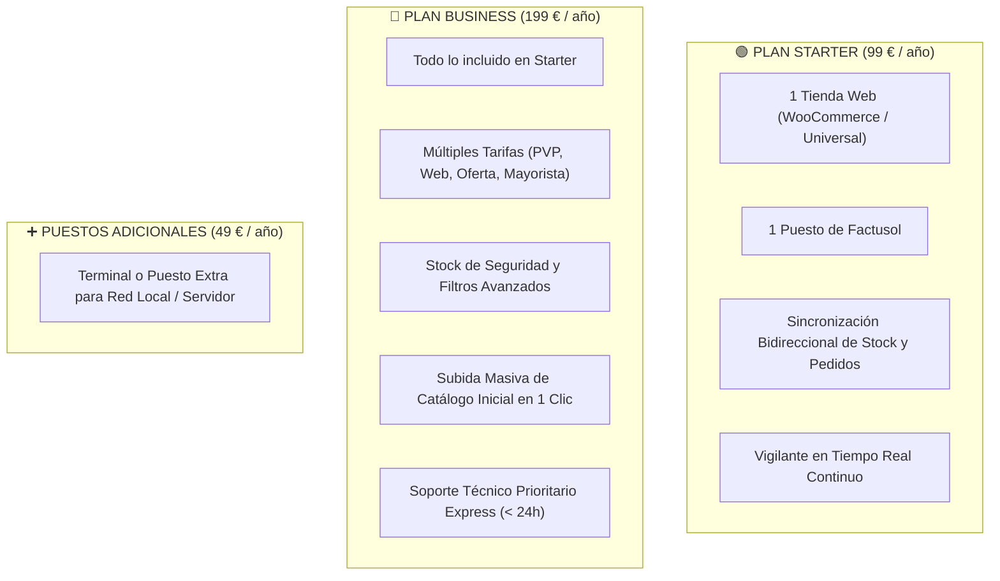
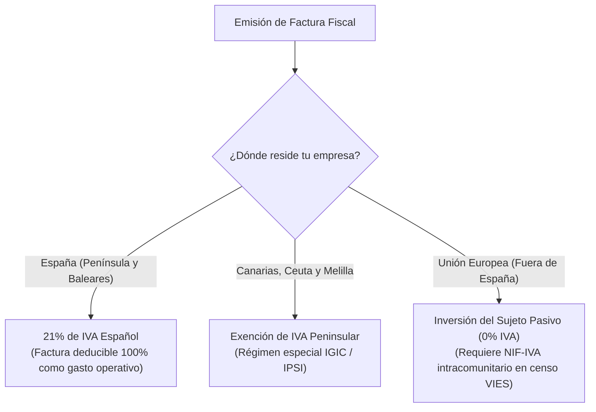

# Planes, Precios y Facturación Oficial: Bentian ERP Bridge
## Transparencia Total, Cero Costes Ocultos y Facturación Automatizada

> **Documento Comercial y Administrativo para Clientes y Departamentos de Compras**  
> **Área:** Tarifas comerciales, condiciones de suscripción, pasarela Stripe y facturación fiscal.  
> **Plataforma:** Bentian ERP Bridge ([https://bridge.cristianjm.com](https://bridge.cristianjm.com))  
> **Vigencia:** Temporada 2026 - 2027

---

## 1. Filosofía Comercial: Todo Incluido y Sin Comisiones por Venta

En Bentian creemos en un modelo de negocio honesto y predecible para el pequeño y mediano comercio. 

- **Cero comisiones sobre tus ventas:** Todo lo que vendas en tu tienda online es íntegramente tuyo. Bentian no cobra porcentajes por pedido ni penalizaciones por volumen de facturación.
- **Sin costes de alta ni mantenimiento oculto:** La cuota anual cubre la licencia, el conector local, el acceso al panel y todas las actualizaciones automáticas.
- **Sin permanencias abusivas:** Renovación anual en un único pago claro, con cancelación en 1 clic desde tu panel cuando lo decidas.

---

## 2. Detalle de Planes Comerciales

Diseñados para adaptarse con precisión tanto a pequeños negocios con un único puesto como a empresas consolidadas con múltiples tarifas y terminales.



### Tabla Comparativa de Características

| Característica / Capacidad | Plan Starter | Plan Business (Recomendado) |
| :--- | :---: | :---: |
| **Precio Anual (pago único anual)** | **99 € / año** (+ IVA) | **199 € / año** (+ IVA) |
| **Coste equivalente al mes** | *8,25 € / mes* | *16,58 € / mes* |
| **Tiendas Web conectadas** | 1 tienda web | 1 tienda web *(ampliable)* |
| **Puestos de Factusol incluidos** | 1 terminal principal | 1 terminal principal *(ampliable)* |
| **Sincronización de Stock Disponible** | ✅ Sí (Tiempo Real) | ✅ Sí (Tiempo Real) |
| **Descarga e Inyección de Pedidos Web** | ✅ Sí (Tiempo Real) | ✅ Sí (Tiempo Real) |
| **Vigilante Local con Autorecuperación** | ✅ Incluido | ✅ Incluido |
| **Soporte de Múltiples Tarifas Factusol** | 1 Tarifa estándar | **Tarifa Habitual + Tarifa Oferta/Web + Mayorista** |
| **Buffer de Stock de Seguridad** | Estándar | **Configurable por unidades mínimas** |
| **Herramienta de Carga Inicial de Catálogo** | Manual | **✅ Subida Masiva con 1 Clic** |
| **Actualizaciones Automáticas de Versión** | ✅ Incluidas | ✅ Incluidas |
| **Nivel de Soporte Técnico** | Soporte Estándar por Ticket / Email | **Soporte Prioritario VIP (< 24h laborables)** |

---

### Módulos Adicionales y Puestos Extra (Add-ons)

- **Puesto Adicional / Terminal Extra:** **49 € / año (+ IVA) por equipo.**
  - Ideal para empresas donde Factusol se ejecuta en varios ordenadores en red local o servidor de Terminal Server / Escritorio Remoto y se desea supervisar o ejecutar agentes adicionales.
- **Tienda Web Adicional (Multitienda B2B / B2C):** Consúltanos para enlazar dos o más tiendas online distintas a la misma empresa de Factusol.

---

## 3. ¿Cómo Funcionan los Pagos? (100% Seguros vía Stripe)

Todos los cobros y suscripciones de Bentian ERP Bridge se procesan a través de **Stripe**, la plataforma de pagos líder en el mundo utilizada por empresas como Amazon, Google, Shopify y Booking.com.

```
┌──────────────────────────────────────────────────────────────────┐
│                   PASARELA DE PAGO STRIPE                        │
│                                                                  │
│  [🔒 Certificación PCI-DSS Nivel 1 - Máxima Seguridad Bancaria]  │
│                                                                  │
│  ✓ Tarjetas de Crédito y Débito (Visa, Mastercard, Maestro, AMEX)│
│  ✓ Pagos rápidos con Apple Pay y Google Pay                      │
│  ✓ Protocolo 3D Secure 2 (Doble factor de autenticación bancaria)│
│                                                                  │
│  * Bentian NUNCA tiene acceso ni almacena tus datos de tarjeta.  │
└──────────────────────────────────────────────────────────────────┘
```

1. **Selección del Plan:** En la web [https://bridge.cristianjm.com](https://bridge.cristianjm.com), seleccionas tu plan y eres redirigido a la pantalla de pago seguro protegida con cifrado SSL de 256 bits.
2. **Confirmación Inmediata:** Tras autorizar el cargo en tu app del banco, el sistema genera de forma automática:
   - Tu **Clave de Licencia oficial (`EB-XXXXX-...`)**, enviada a tu correo al instante.
   - Tu enlace de descarga del instalador (`BentianSetup.exe`).
   - Tu **factura fiscal oficial en PDF**.

---

## 4. Facturación Oficial y Régimen Fiscal (IVA y VIES)

La facturación de Bentian cumple de manera estricta con el reglamento de facturación de la Agencia Estatal de Administración Tributaria (AEAT) en España y las normativas comunitarias de la Unión Europea.



### Información Fiscal en cada Factura
Cada recibo emitido por el sistema contiene todos los campos obligatorios para su deducción contable:
- Número de factura con serie correlativa anual.
- Fecha y hora de expedición.
- Datos fiscales del emisor (Razón social, NIF, domicilio fiscal en España).
- Datos fiscales del cliente (Nombre comercial o razón social, CIF/NIF, dirección completa).
- Base imponible, tipo impositivo aplicado (21% o exento) y total factura en Euros (€).

---

## 5. Portal de Autoservicio de Cliente de Stripe

Como cliente de Bentian, dispones de acceso autónomo a tu **Portal de Cliente de Stripe las 24 horas del día**, sin necesidad de llamar por teléfono ni enviar correos administrativos.

### ¿Cómo acceder a tu Portal de Autoservicio?
Puedes entrar de dos formas muy sencillas:
1. Desde el enlace que encontrarás al pie de cualquier correo de confirmación de pago o factura de Stripe.
2. Desde la propia aplicación en tu ordenador: ve a la pestaña **Licencia** ➔ pulsa el botón **"Gestionar en Cloud ↗"**.

```
┌──────────────────────────────────────────────────────────────────┐
│              PORTAL DE AUTOSERVICIO STRIPE BENTIAN               │
├──────────────────────────────────────────────────────────────────┤
│                                                                  │
│  Suscripción Activa: Bentian ERP Bridge — Plan Business          │
│  Importe: 199,00 € + IVA / año                                   │
│  Próxima renovación: 28 de septiembre de 2027                    │
│                                                                  │
│  [📥 Descargar Facturas en PDF]  <── Facturas oficiales con NIF  │
│  [💳 Actualizar Método de Pago]  <── Cambiar número de tarjeta   │
│  [✏️ Modificar Datos Fiscales]   <── Cambiar dirección o CIF     │
│  [❌ Cancelar Suscripción]       <── Baja voluntaria sin multas  │
│                                                                  │
└──────────────────────────────────────────────────────────────────┘
```

### Operaciones Disponibles en el Portal de Autoservicio:

1. **Descargar Facturas Oficiales en PDF:**
   - Consulta el histórico completo de todas tus cuotas anuales.
   - Descarga el PDF con validez contable para entregarlo directamente a tu asesoría fiscal.
2. **Actualizar el Método de Pago:**
   - Si tu tarjeta ha caducado o has cambiado de entidad bancaria, introduce la nueva tarjeta en 30 segundos para evitar que la sincronización se detenga por falta de pago.
3. **Modificar los Datos Fiscales:**
   - Si tu empresa cambia de domicilio fiscal o razón social, puedes corregirlo en el portal y las siguientes facturas se emitirán automáticamente con los nuevos datos.
4. **Gestión de la Renovación y Cancelación en 1 Clic:**
   - No hay cláusulas ocultas: puedes pulsar **"Cancelar plan"** en cualquier momento.
   - Si cancelas, **tu programa seguirá funcionando con total normalidad hasta el último día del año ya pagado**. Al llegar esa fecha, simplemente no se pasará ningún cobro y la licencia se dará de baja sin ningún recargo ni penalización.

---

## 6. Notificaciones Preventivas de Cobro

Para que nunca tengas sorpresas en tu cuenta bancaria:
- **Aviso con 15 días de antelación:** Dos semanas antes de la fecha de renovación anual, recibirás un correo electrónico informativo indicando la fecha exacta del próximo cobro y el importe que se cargará en la tarjeta asociada.
- **Gestión de incidencias de cobro:** Si la tarjeta es rechazada (por límite diario, fondos insuficientes o tarjeta caducada), el conector no se detendrá de inmediato: dispondrás de varios días de margen para actualizar la tarjeta mientras el sistema te envía alertas por correo para regularizar la situación sin interrumpir las ventas de tu tienda online.

---

## 7. Preguntas Frecuentes sobre Facturación

### ¿Puedo cambiar de Plan Starter a Plan Business más adelante?
**Sí, en cualquier momento.** Si empezaste con el Plan Starter y tu catálogo crece o necesitas gestionar tarifas de mayorista/oferta, puedes subir al Plan Business desde tu panel. El sistema calculará automáticamente la parte proporcional (*prorrateo*) de lo que ya pagaste, cobrándote únicamente la diferencia por los meses restantes.

### ¿Se emite factura con retención de IRPF?
El suministro de software bajo licencia SaaS no está sujeto a retención de IRPF según la normativa de la Dirección General de Tributos española; se factura con IVA repercutido estándar al 21%.

### ¿Qué ocurre con mis datos si decido no renovar?
Los datos de tus artículos, clientes y ventas siempre residen en tu propio Factusol y en tu tienda online. Bentian no secuestra jamás tus datos. Si cancelas la suscripción, tus bases de datos quedan 100% intactas en tu poder; únicamente cesará el envío automático de sincronizaciones entre ambos sistemas.

---

> **¿Tienes alguna duda sobre tu suscripción o necesitas una cotización personalizada?**  
> Escríbenos a `facturacion@bentian.es` o visita el portal oficial en [https://bridge.cristianjm.com](https://bridge.cristianjm.com).
