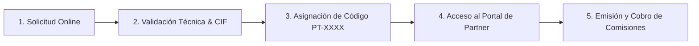

# Programa Oficial de Partners y Distribuidores: Bentian ERP Bridge
## "Comisiones del 25% Recurrentes y Vitalicias: Rentabiliza tu Cartera Conectando Factusol"

> **Documento Oficial para Canal de Distribución**  
> **Destinatarios:** Empresas de soporte informático, técnicos de sistemas, agencias de diseño y marketing digital, consultores ERP y profesionales freelance.  
> **Plataforma:** Bentian ERP Bridge ([https://bridge.cristianjm.com](https://bridge.cristianjm.com))  
> **Vigencia:** 2026 - Vitalicio

---

## 1. PROPUESTA DE VALOR PARA EL PARTNER: ¿POR QUÉ OFRECER BENTIAN?

Como profesional informático o agencia digital, conoces de primera mano el mayor dolor de cabeza de las PYMEs y comercios españoles: **tienen Factusol en su servidor local y una tienda online (WooCommerce, PrestaShop o desarrollo a medida) en la nube, pero ambos sistemas viven en islas desconectadas.**

La consecuencia es siempre la misma:
- Empleados picando pedidos a mano durante horas cada mañana.
- Errores constantes de transcripción en direcciones, NIFs y líneas de artículos.
- Ventas de productos que ya se habían vendido en el mostrador físico (roturas de stock).
- Clientes enfadados y devoluciones que devoran el margen comercial.

Hasta ahora, conectar Factusol implicaba desarrollar scripts frágiles en PHP con conectores ODBC obsoletos, programar tareas programadas en Windows propensas a fallar, o pagar miles de euros en desarrollos a medida que se rompían con cada actualización de Factusol o de Windows.

### Bentian ERP Bridge cambia las reglas del juego
Bentian ERP Bridge es un conector de nivel empresarial desarrollado específicamente para Windows y Factusol que resuelve esta integración en **menos de 5 minutos**:

1. **Instalación Plug & Play sin fricción:** Se instala con un ejecutable de Windows estándar, se ancla al System Tray (área de notificaciones) y arranca automáticamente como servicio en segundo plano.
2. **Seguridad Local-First (Sin abrir puertos):** No requiere abrir puertos en el router del cliente, no expone la base de datos a internet, no requiere IPs fijas ni configuraciones complejas de VPN. Cumple al 100% con el RGPD.
3. **Lectura Segura y Transaccional:** Conexión nativa OLEDB con control de concurrencia. Jamás bloquea a los empleados que están facturando en Factusol ni corrompe las tablas de Access.
4. **Cero Mantenimiento para ti:** Actualizaciones silenciosas automáticas, tolerancia a caídas de red (almacenamiento local *Store & Forward*) y autorecuperación. Tus clientes no te llamarán el fin de semana por un conector colgado.

---

## 2. EL PROGRAMA DE COMISIONES: 25% RECURRENTE Y VITALICIO

En Bentian no creemos en comisiones puntuales de captación de 20 € o 30 €. Creemos en construir relaciones estratégicas y duraderas con los profesionales que están sobre el terreno asesorando al cliente final.

Por eso, nuestro programa de partners ofrece una de las condiciones más atractivas de toda la industria del software empresarial:

$$\mathbf{25\%\ de\ comisi\acute{o}n\ neta\ recurrente\ de\ por\ vida}$$

* **Recurrencia real año tras año:** Cobras el 25% cuando el cliente se da de alta, y **sigues cobrando el 25% cada vez que el cliente renueva su suscripción** (anual o mensual), durante toda la vida útil del cliente en la plataforma.
* **Sin techos ni límites de clientes:** Cuantos más clientes conectes, mayor será tu volumen mensual o anual pasivo.
* **Modelo de negocio acumulativo:** En software de infraestructura crítica (donde el cliente tiene su stock y pedidos funcionando de forma automática), la tasa de cancelación (*churn rate*) es inferior al 5% anual. Cada cliente que sumas es un ingreso garantizado para los próximos años.
* **Independencia en tus propios honorarios:** La comisión del 25% de la licencia es solo una parte de tu beneficio. Como partner autorizado, tú cobras al cliente **tus propias tarifas profesionales** por la puesta en marcha, auditoría de catálogo, formación y mantenimiento informático. Bentian no interfiere jamás en tus tarifas de servicio.

---

## 3. PROYECCIONES REALES DE INGRESOS PASIVOS

A continuación se detallan simulaciones reales basadas en el **Plan Business de Bentian ERP Bridge (199 €/año + IVA)**, el plan estándar más contratado por pequeñas y medianas empresas:

| Cartera de Clientes Activos | Facturación Licencias Bentian / Año | Tu Comisión Recurrente Vitalicia (25%) | Estimación de Ingresos por Tus Servicios de Instalación* | **Beneficio Total Año 1** | **Ingreso Pasivo Anual (Año 2 en adelante)** |
| :---: | :---: | :---: | :---: | :---: | :---: |
| **5 Clientes** | 995,00 € | **248,75 € / año** | ~750,00 € | **~998,75 €** | **248,75 € / año** |
| **10 Clientes** | 1.990,00 € | **497,50 € / año** | ~1.500,00 € | **~1.997,50 €** | **~500,00 € / año** |
| **25 Clientes** | 4.975,00 € | **1.243,75 € / año** | ~3.750,00 € | **~4.993,75 €** | **~1.243,75 € / año** |
| **50 Clientes** | 9.950,00 € | **2.487,50 € / año** | ~7.500,00 € | **~9.987,50 €** | **~2.500,00 € / año** |
| **100 Clientes** | 19.900,00 € | **4.975,00 € / año** | ~15.000,00 € | **~19.975,00 €** | **~5.000,00 € / año** |

*\*Estimación conservadora basada en un cobro medio de 150 € por cliente en concepto de puesta en marcha, mapeo de tarifas/IVA y configuración del puente.*

> **Ejemplo de un informático o agencia con 20 clientes locales:**  
> Tras conectar a 20 comercios de su zona:  
> - Factura **3.000 € directos** a sus clientes por la instalación y sincronización inicial de su tienda.  
> - Recibe un **pago pasivo recurrente de ~1.000 € netos al año**, depositados en su cuenta bancaria puntualmente, sin tener que dedicar horas extra de trabajo.

---

## 4. CÓMO DARSE DE ALTA COMO PARTNER OFICIAL

El proceso de adhesión es gratuito, sin costes de entrada ni compras mínimas iniciales:

### Paso 1: Solicitud de Registro
- Rellena el formulario de alta en el portal oficial: [https://bridge.cristianjm.com/partners](https://bridge.cristianjm.com/partners) o contacta por correo a `partners@bentian.es` indicando:
  * Razón Social o Nombre del Autónomo y CIF/NIF.
  * Sitio web o perfil profesional.
  * Número aproximado de clientes que utilizan Factusol o plataformas eCommerce (WooCommerce/PrestaShop).

### Paso 2: Asignación de tu Identificador Oficial (`PT-XXXX`)
En menos de 24 horas laborables recibirás tu credencial de acreditación:
- **Código Oficial de Partner:** Un identificador único e intransferible (ejemplo: `PT-1042`).
- **Partner Secret:** Tu clave de autenticación criptográfica para acceder al portal.
- **Enlace de Afiliado Corporativo:** `https://bridge.cristianjm.com/checkout?partner=PT-XXXX`.

### Paso 3: Acceso al Portal de Partner
Inicia sesión directamente en la plataforma central a través del endpoint de acceso a canal:
- **URL del Portal:** `https://bridge.cristianjm.com/dashboard/partner`
- **Autenticación:** Vía `POST /api/v1/auth/partner-login` con tu código `PT-XXXX` y clave secreta.

---

## 5. DOS MODALIDADES PARA ASOCIAR O EMITIR LICENCIAS

Diseñado para ajustarse a la forma de trabajar de cada empresa tecnológica:

### Modalidad A: Gestión Integral por el Partner (Reseller / Distribuidor)
*Ideal para consultoras y empresas de soporte IT que prefieren facturar todo en un único paquete mensual o anual a su cliente.*

1. Accedes a tu Portal de Partner en Bentian.
2. Pulsas en **"Emitir Licencia de Cliente"** (API: `POST /api/v1/licenses/partner/licenses/issue`).
3. Introduces la Razón Social y el CIF/NIF del cliente (`clientName`, `clientTaxId`).
4. El sistema genera de inmediato la clave de activación corporativa `EB-XXXXX` con tarifa de partner (con el 25% de descuento ya aplicado o con facturación directa al partner a precio mayorista).
5. Instalas Bentian en el servidor del cliente y activas con la clave `EB-XXXXX`.
6. Tú facturas a tu cliente el importe completo de la licencia (o lo incluyes en tu cuota de mantenimiento IT).

### Modalidad B: Enlace de Afiliado Directo (El Cliente Compra en Bentian)
*Ideal para técnicos freelance, diseñadores web o agencias de marketing que prefieren no asumir la gestión de cobro de licencias de software de terceros.*

1. Le proporcionas a tu cliente tu enlace personalizado:  
   `https://bridge.cristianjm.com/checkout?partner=PT-XXXX`  
   *(o le indicas que introduzca tu código `PT-XXXX` en la casilla de cupón/código de distribuidor en la pasarela Stripe).*
2. El cliente introduce su tarjeta bancaria y recibe automáticamente su factura oficial con IVA emitida por Bentian.
3. El sistema vincula de forma irrevocable el campo `reseller_id = 'PT-XXXX'` en la base de datos de organizaciones (`organizations`).
4. Tu comisión del 25% queda registrada automáticamente en tu saldo a favor.

---

## 6. LIQUIDACIÓN, FACTURACIÓN Y PAGO DE COMISIONES

Garantizamos un procedimiento de pago riguroso, claro y puntual:

* **Periodicidad de Liquidación:** Mensual o Trimestral (a elección del partner), dentro de los primeros 5 días hábiles del periodo siguiente.
* **Umbral Mínimo:** 50,00 € acumulados (si no se alcanza, el saldo se acumula sin caducidad para el siguiente ciclo).
* **Métodos de Cobro:**
  - **Transferencia Bancaria Directa (SEPA):** A cualquier cuenta bancaria IBAN de la Unión Europea.
  - **Stripe Connect:** Transferencia directa e instantánea a tu saldo de Stripe.
* **Gestión Fiscal Española:**
  - El software emite mensualmente un borrador detallado con el desglose de clientes, importes brutos y comisión devengada.
  - El partner emite su factura por *Servicios de Intermediación Comercial* (con su correspondiente 21% de IVA y retención de IRPF si es autónomo individual, o IVA para Sociedades Limitadas).
  - Una vez recibida la factura por correo a `facturacion@bentian.es`, el abono se ejecuta en 24-48 horas laborables.

### Métricas en Tiempo Real en tu Panel de Control
Desde el Dashboard de Partner (`/partner/clients`), tienes total visibilidad de:
- **Clientes Activos:** Lista completa de clientes vinculados a tu código `PT-XXXX`.
- **Estado de Sincronización:** Si el conector del cliente está operativo o desconectado.
- **Próximas Renovaciones:** Calendario de vencimientos a 30, 60 y 90 días vista.
- **Comisiones Devengadas:** Saldo acumulado en el mes en curso y comisiones históricas ya liquidadas.

---

## 7. GARANTÍA DE PROTECCIÓN DE CLIENTE (POLÍTICA "CLIENT-LOCK")

Uno de los mayores temores de los informáticos y distribuidores al prescribir software de terceros es que el fabricante "se salte al intermediario" con el tiempo. En Bentian tenemos una política de blindaje absoluto:

1. **Vinculación Irrevocable:** Una vez que un CIF/NIF de cliente se registra bajo tu código `PT-XXXX`, ese cliente queda blindado en base de datos (`organizations.reseller_id = 'PT-XXXX'`). Ningún otro distribuidor ni venta directa puede desvincularlo.
2. **Comisión Vitalicia en Renovaciones Directas:** Aunque el cliente decida renovar su suscripción por su cuenta directamente en la web de Bentian sin avisarte, el sistema detecta su cuenta y **te liquida tu 25% íntegro**.
3. **Respeto Absoluto al Canal:** Bentian es un proveedor de tecnología. **Jamás prestamos servicios de mantenimiento informático, redes ni diseño web.** Si un cliente tuyo solicita ayuda para configurar su red o modificar su tienda, lo derivamos de vuelta a ti como su partner de referencia.
4. **Soporte Técnico de Nivel 2 Prioritario:** Como partner oficial, dispones de una línea directa de asistencia técnica por WhatsApp y correo (`partners@bentian.es`) para apoyarte en cualquier incidencia técnica compleja durante la instalación en casa del cliente.

---

## 8. RESUMEN: CÓMO EMPEZAR HOY

| Paso | Acción | Tiempo estimado |
| :---: | :--- | :---: |
| **1** | Envía un email a `partners@bentian.es` solicitando tu código `PT-XXXX`. | 2 minutos |
| **2** | Recibe tu código de partner y acceso al Dashboard de Partner. | < 24 horas |
| **3** | Descarga el instalador y el dossier comercial para tus clientes. | Inmediato |
| **4** | Conecta el primer cliente y genera tu primer ingreso recurrente vitalicio. | 5 minutos por instalación |

**¿Tienes dudas técnicas o comerciales?**  
Contacta directamente con el Responsable de Canal de Distribución:  
📧 Email: `partners@bentian.es` | `soporte@cristianjm.com`  
🌐 Portal Web: [https://bridge.cristianjm.com](https://bridge.cristianjm.com)  
Oficinas Centrales: Bentian Solutions S.L. - España
