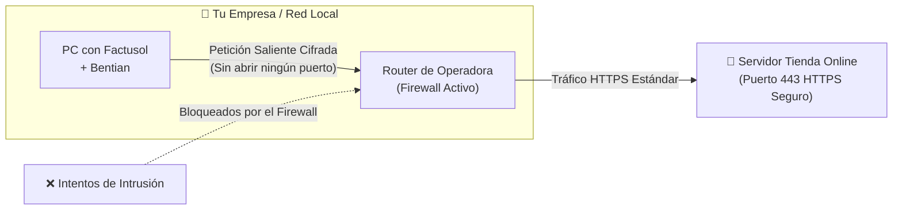
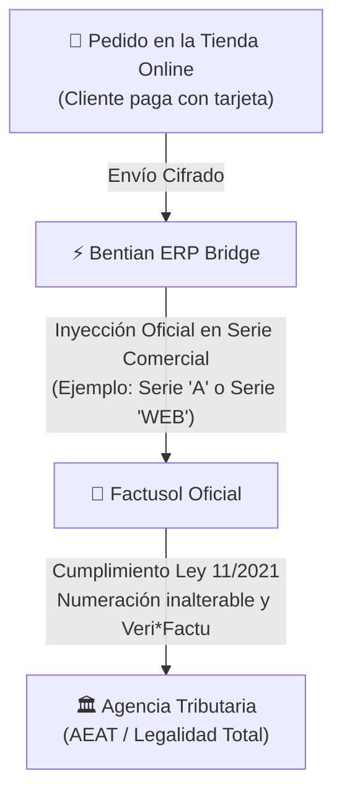

# Resolución de Dudas y Preguntas Frecuentes (FAQ Anti-Llamadas)
## Bentian ERP Bridge — Guía de Autoservicio y Resolución Inmediata

> **Manual de Consulta Rápida para Clientes, Comercios y Administradores de Sistemas**  
> **Objetivo:** Resolver el 100% de las dudas habituales de forma inmediata, clara y autónoma, sin necesidad de esperar al teléfono de soporte.  
> **Plataforma:** Bentian ERP Bridge ([https://bridge.cristianjm.com](https://bridge.cristianjm.com))

---

## 🧭 Índice Rápido de Preguntas

1. [¿Tengo que abrir puertos en el router o configurar una IP fija?](#1-tengo-que-abrir-puertos-en-el-router-o-configurar-una-ip-fija)
2. [¿Qué pasa si se va la luz o se corta la conexión a internet en la oficina?](#2-qué-pasa-si-se-va-la-luz-o-se-corta-la-conexión-a-internet-en-la-oficina)
3. [¿Puedo tener Factusol abierto mientras Bentian trabaja? ¿Bloqueará a mis empleados?](#3-puedo-tener-factusol-abierto-mientras-bentian-trabaja-bloqueará-a-mis-empleados)
4. [¿Qué pasa si cambio de ordenador o el equipo antiguo se estropea?](#4-qué-pasa-si-cambio-de-ordenador-o-el-equipo-antiguo-se-estropea)
5. [¿Cumple con la Ley Antifraude española y los requisitos de Veri*Factu?](#5-cumple-con-la-ley-antifraude-española-y-los-requisitos-de-verifactu)
6. [¿Cómo añado exclusiones en Windows Defender si el antivirus interfiere con el programa?](#6-cómo-añado-exclusiones-en-windows-defender-si-el-antivirus-interfiere-con-el-programa)
7. [¿Cómo calcula Bentian el stock disponible para no vender de más en internet?](#7-cómo-calcula-bentian-el-stock-disponible-para-no-vender-de-más-en-internet)
8. [¿Puedo conectar una base de datos de Factusol que está en un servidor NAS o unidad compartida?](#8-puedo-conectar-una-base-de-datos-de-factusol-que-está-en-un-servidor-nas-o-unidad-compartida)
9. [¿Cómo se sincronizan los precios si tengo varias tarifas en Factusol?](#9-cómo-se-sincronizan-los-precios-si-tengo-varias-tarifas-en-factusol)
10. [¿Se actualiza el software solo o tengo que descargar parches a mano?](#10-se-actualiza-el-software-solo-o-tengo-que-descargar-parches-a-mano)

---

## 1. ¿Tengo que abrir puertos en el router o configurar una IP fija?

> **RESPUESTA CORTA: NO. Rotundamente no.**



### Explicación detallada:
- **Cero puertos abiertos:** La inmensa mayoría de conectores antiguos exigían abrir puertos en el router (como el puerto 3306 de MySQL o puertos de escritorio remoto), lo que convertía la red del comercio en un blanco fácil para virus, ciberdelincuentes y ataques de ransomware.
- **Conexión exclusivamente saliente:** Bentian trabaja mediante peticiones seguras salientes por el **puerto estándar 443 (HTTPS)** con cifrado TLS de última generación. Es exactamente el mismo mecanismo que utiliza tu navegador web cuando accedes a la banca online de tu empresa.
- **Compatible con cualquier operador:** Funciona a la perfección con conexiones de fibra óptica estándar (Movistar, Vodafone, Orange, Digi, etc.), líneas con **CG-NAT**, conexiones por satélite o conexiones 4G/5G, sin necesidad de contratar IPs fijas ni configurar complejas redes VPN.

---

## 2. ¿Qué pasa si se va la luz o se corta la conexión a internet en la oficina?

> **RESPUESTA CORTA: Absolutamente nada. Tu negocio y tus ventas están 100% protegidos.**

Bentian ERP Bridge cuenta con una arquitectura de **tolerancia a caídas y almacenamiento local de seguridad**:

1. **Durante el corte de luz o internet:**
   - La tienda web sigue funcionando de forma autónoma en su servidor en la nube, recibiendo pedidos con total normalidad.
   - En tu ordenador local, en cuanto se apaga o pierde señal, el sistema no corrompe ninguna tabla ni pierde ningún dato gracias a su motor transaccional.
2. **En cuanto vuelve el suministro e internet:**
   - Bentian arranca automáticamente junto con Windows.
   - Descarga al instante todos los pedidos que hayan entrado en la tienda online durante el tiempo de desconexión y los registra en Factusol de forma correlativa.
   - Envía a la tienda el stock actualizado de Factusol para reflejar cualquier venta o movimiento físico.
3. **Período de Gracia Offline de 7 Días:**
   - Si sufres una avería en la línea telefónica que dure varios días, la licencia de Bentian dispone de un **período de gracia de 168 horas (7 días continuos)** en el que sigue trabajando localmente sin bloquearse, esperando a que la conexión a internet sea restablecida.

---

## 3. ¿Puedo tener Factusol abierto mientras Bentian trabaja? ¿Bloqueará a mis empleados?

> **RESPUESTA CORTA: SÍ, puedes trabajar con normalidad. No bloquea a nadie.**

```
┌──────────────────────────────────────────────────────────────────┐
│          TRABAJO SIMULTÁNEO SIN CONFLICTOS DE ARCHIVO            │
├──────────────────────────────────────────────────────────────────┤
│                                                                  │
│  🖥️ Factusol (Empleado en Mostrador)  ──► Facturación continua    │
│  🖥️ Factusol (Administración / Oficina)► Albaranes y cobros      │
│  ⚡ Bentian Agent (Segundo Plano)       ──► Lee existencias y graba │
│                                             pedidos web en OLEDB │
│                                                                  │
│  ✓ Modo Compartido: Acceso no exclusivo de lectura y escritura.  │
│  ✓ Cero pantallas congeladas, cero bloqueos de fichero (.ldb).   │
└──────────────────────────────────────────────────────────────────┘
```

- **Acceso Concurrente OLEDB:** Bentian no abre Factusol como si fuera una persona haciendo clics en pantalla. Se comunica de forma nativa a través del motor de base de datos de Windows en **modo compartido no exclusivo**.
- **Respeto a las sesiones de trabajo:** Tus comerciales, administrativos y cajeros pueden tener Factusol abierto, emitir facturas, cobrar en caja o listar informes sin experimentar ralentizaciones ni mensajes de error de "archivo en uso".
- **Estabilización inteligente:** Antes de leer un archivo tras una modificación masiva, el vigilante de Bentian espera unos segundos de estabilización para asegurarse de que Factusol ha terminado de guardar el documento.

---

## 4. ¿Qué pasa si cambio de ordenador o el equipo antiguo se estropea?

> **RESPUESTA CORTA: Puedes mudar tu licencia a tu nuevo PC en menos de 2 minutos.**

Tu suscripción te da derecho al uso continuado del software. No estás atado a un ordenador físico específico de por vida.

### Caso A: Cambio de ordenador planificado (tienes acceso al PC antiguo)
1. En el ordenador antiguo: abre Bentian, ve a la pestaña **Licencia** y pulsa **"Desvincular Equipo"** (o accede al panel web).
2. En el ordenador nuevo: descarga `BentianSetup.exe`, instálalo e introduce tu clave habitual (`EB-XXXXX-...`).
3. El nuevo equipo quedará vinculado de forma instantánea.

### Caso B: Rotura o avería grave (el ordenador antiguo no enciende)
1. Entra desde cualquier teléfono o navegador a tu **Panel de Cliente Cloud** ([https://bridge.cristianjm.com](https://bridge.cristianjm.com)).
2. En el apartado de tus licencias activas, pulsa **"Restablecer Puesto / Desvincular HWID"**.
3. Abre el nuevo ordenador, pega tu clave en el asistente y tu conector volverá a estar operativo al 100%.
4. *(Si no recuerdas cómo entrar, envía un correo a `soporte@cristianjm.com` desde el email con el que compraste y liberaremos tu puesto de inmediato).*

---

## 5. ¿Cumple con la Ley Antifraude española y los requisitos de Veri*Factu?

> **RESPUESTA CORTA: SÍ, cumplimiento riguroso y transparente.**



### Marco Normativo y Legalidad:
1. **No altera registros fiscales existentes:** Bentian no modifica facturas emitidas ni toca la numeración tributaria de Factusol.
2. **Registro transparente de pedidos:** Bentian actúa como un puente comercial: toma el pedido formalizado por el cliente en tu web e inserta un **Pedido de Cliente** o un **Albarán** en la serie que tú elijas en Factusol (por ejemplo, en la serie `A`, serie `W` o serie `WEB`).
3. **Factusol sigue siendo el garante tributario:** La emisión final de la factura oficial, el encadenamiento de registros de facturación y el futuro envío a la plataforma de la Agencia Tributaria (**Veri*Factu**) se llevan a cabo íntegramente dentro de Factusol mediante los mecanismos homologados por Software DELSOL. Tu empresa opera con la más estricta seguridad jurídica.

---

## 6. ¿Cómo añado exclusiones en Windows Defender si el antivirus interfiere con el programa?

> **Si Windows Defender o tu antivirus corporativo ralentiza o pone en cuarentena algún archivo de sincronización, sigue esta sencilla guía oficial de 1 minuto.**

### Paso a Paso en Windows 10 y Windows 11:

1. Pulsa la tecla **Inicio** en tu teclado y escribe **"Seguridad de Windows"** (o haz clic en el icono del escudo blanco junto al reloj).
2. Haz clic en el apartado **"Protección contra virus y amenazas"**.
3. En la sección *Configuración de Protección contra virus y amenazas*, haz clic en el enlace azul **"Administrar la configuración"**.
4. Baja con el ratón hasta el final de la pantalla, donde verás el apartado **"Exclusiones"**, y pulsa en **"Agregar o quitar exclusiones"**. *(Si Windows te pide confirmación de Administrador, pulsa Sí)*.
5. Haz clic en el botón **"+ Agregar una exclusión"** y elige la opción **"Carpeta"**.
6. Añade las dos siguientes rutas oficiales de Bentian:

```
Ruta 1 (Programa):  C:\Program Files\Bentian Agent
Ruta 2 (Datos):     %APPDATA%\Bentian Agent
```

> [!TIP]
> **¿Cómo poner la segunda ruta en el explorador?**  
> Simplemente copia `%APPDATA%\Bentian Agent` y pégalo en la barra superior del explorador de carpetas, o navega hasta `C:\Usuarios\<TuUsuario>\AppData\Roaming\Bentian Agent`.

7. *(Opcional)* Si tu base de datos de Factusol está en una carpeta compartida de red o NAS (por ejemplo `Z:\Datos\FS`), puedes agregar también esa carpeta a las exclusiones para que la lectura de artículos sea ultra rápida.

---

## 7. ¿Cómo calcula Bentian el stock disponible para no vender de más en internet?

> **Bentian utiliza la fórmula del Stock Disponible Real (Anti-Sobreventas).**

Muchos conectores cometen el grave error de sincronizar únicamente el "Stock Físico Actual", ignorando los pedidos que ya están comprometidos.

```
┌──────────────────────────────────────────────────────────────────┐
│                   FÓRMULA DE STOCK DISPONIBLE                    │
├──────────────────────────────────────────────────────────────────┤
│                                                                  │
│    Stock Físico en Almacén                                       │
│  - Unidades ya vendidas en pedidos pendientes de servir          │
│  - Buffer de Stock de Seguridad configurado (opcional)           │
│  ─────────────────────────────────────────────────────────────   │
│  = STOCK REAL PUBLICADO EN TU TIENDA ONLINE                      │
│                                                                  │
│  ✓ Ejemplo: Si tienes 10 unidades en estantería pero 3 están     │
│    en un albarán reservado para entregar mañana, Bentian         │
│    publicará exactamente 7 unidades en tu tienda online.         │
│  ✓ Nunca venderás un producto que ya esté comprometido.          │
└──────────────────────────────────────────────────────────────────┘
```

---

## 8. ¿Puedo conectar una base de datos de Factusol que está en un servidor NAS o unidad compartida?

> **SÍ, 100% compatible con redes locales y cabinas NAS.**

Bentian soporta de forma nativa:
- **Unidades de red asignadas:** Rutas con letra de unidad (por ejemplo `Z:\Factusol\Datos\FS\0012026.accdb`).
- **Rutas UNC directas:** Rutas de red puras (por ejemplo `\\SERVIDOR-PRINCIPAL\Factusol\Datos\FS\0012026.accdb` o `\\NAS_EMPRESA\Datos\0012026.accdb`).

> [!NOTE]
> **Protección Anti-Caídas de Red:** Si en algún momento la unidad de red se desconecta temporalmente por un microcorte del switch de la oficina, Bentian **jamás borrará tu configuración**. Mantendrá la ruta guardada y volverá a conectar automáticamente en cuanto la red responda.

---

## 9. ¿Cómo se sincronizan los precios si tengo varias tarifas en Factusol?

En Factusol puedes disponer de varias tarifas de venta (por ejemplo: Tarifa 1 = Tienda Física / Mostrador; Tarifa 2 = Tienda Online; Tarifa 3 = Mayoristas B2B).

- En la pantalla de configuración de Bentian (pestaña **Factusol ERP**), puedes seleccionar con un solo clic qué tarifa se publica como precio principal de tu web.
- Si utilizas el **Plan Business**, puedes además configurar una **Tarifa de Oferta**: si un producto tiene un precio rebajado en esa tarifa, en tu tienda online aparecerá automáticamente con el **precio tachado** (ejemplo: ~~30,00 €~~ 24,95 €) para atraer más ventas.

---

## 10. ¿Se actualiza el software solo o tengo que descargar parches a mano?

> **Bentian se actualiza de forma automática y silenciosa.**

- No tendrás que descargar instaladores cada mes ni preocuparte por parches de seguridad.
- Cuando nuestro equipo de ingeniería publica una mejora de rendimiento, compatibilidad con nuevas versiones de Factusol o novedades de WooCommerce, el agente de tu ordenador detecta la actualización, la verifica con firmas criptográficas de alta seguridad y la instala de forma transparente sin interrumpir tus operaciones.
- En la pantalla principal verás siempre el indicador de versión al día.

---

## 📞 ¿Sigues Necesitando Asistencia?

Si tu consulta no figura en este listado o necesitas ayuda con una configuración especial:

- 📩 **Correo de Soporte Técnico:** `soporte@cristianjm.com`  
- 🏢 **Portal de Clientes y Estado del Servicio:** [https://bridge.cristianjm.com](https://bridge.cristianjm.com)  
- ⏱️ **Tiempo de respuesta:** Menos de 24 horas laborables (o soporte prioritario en el Plan Business).
